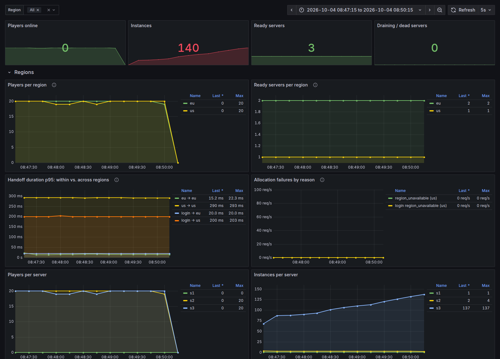
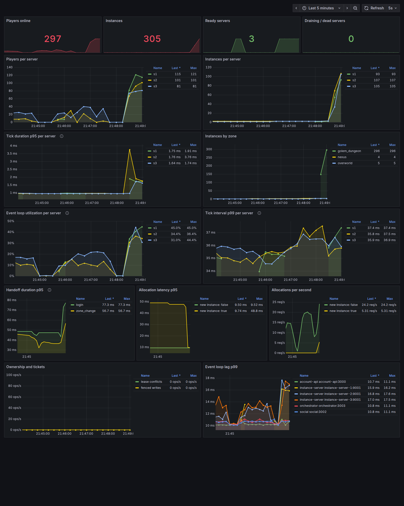

# Realm of the Mad God (RotMG) Voxel MMO Clone

A fast, server-authoritative, 3D isometric bullet-hell MMO clone built with **TypeScript**, **Three.js**, **React**, **Vite**, **Node.js**, **WebSockets**, **bitECS**, **Prisma**, and **PostgreSQL**.

---

## Features

- **3D Isometric Voxel Graphics**: Procedural voxel characters, monsters, loot bags, and portals constructed from 3D arrays with high-performance exposed-face culling geometry and vertex coloring.
- **Chunked Terrain System**: 32x32 chunked 2D grid rendering with 3D extruded obstacles and wall blocks (stone walls, trees, obsidian dungeon blocks, pillars).
- **Layered Server Architecture**: A WebSocket gateway, a world cluster, and out-of-band persistence wrap a pure, zero-I/O ECS simulation. Each world (**Nexus**, **Realm**, **Dungeon**) ticks at 30 Hz. See [`docs/ARCHITECTURE.md`](docs/ARCHITECTURE.md).
- **Deterministic Bullet Hell Combat**: Client & server share projectile formulas. Projectiles animate at 60+ FPS locally while the server validates hits and resolves authoritative damage.
- **Client-Side Prediction & Reconciliation**: Responsive WASD movement with local prediction against 2D tile collision maps, plus server reconciliation and entity interpolation.
- **Authentic RotMG Camera**: 3D Isometric camera with **Q / R** rotation, ground plane mouse raycasting, and toggleable **Z** off-center view to anticipate incoming bullets.
- **Persistence & Quick Onboarding**: Instant guest login with localStorage token persistence in PostgreSQL via Prisma.
- **Permadeath & Loot**: Dying in the realm triggers permadeath; defeating enemies and bosses drops loot bags.

---

## Monorepo Architecture

Deployables live in `apps/`, libraries in `packages/`. Apps never import each other; `pnpm lint:deps` enforces the boundaries.

```
mmoexile/
├── apps/
│   ├── client/           # Vite + Three.js isometric renderer, React HUD, login & character select
│   ├── account-api/      # Login, characters, /play (Fastify, :3000)
│   ├── social/           # Parties for the whole realm (Fastify, :3002)
│   ├── orchestrator/     # Fleet registry, region-aware instance allocation, the only ticket issuer (Fastify, :3003)
│   ├── directory/        # The realm and its regions with their ping URLs (Fastify, :3004)
│   └── instance-server/  # Hosts instances: WebSocket gateway, simulation, handoffs, draining (:3001 / :7001+)
├── packages/
│   ├── game-core/        # Math, maps, zones, items, prefabs, progression, combat formulas, ECS components
│   ├── protocol/         # Client ⇄ server packets and snapshots (MessagePack)
│   ├── simulation/       # Pure bitECS GameWorld + systems (zero I/O)
│   ├── contracts/        # Service APIs, broker channels, Redis keys (zod schemas)
│   ├── auth/             # Session tokens (HS256) and transfer tickets (Ed25519 JWT)
│   ├── messaging/        # Broker over Redis pub/sub (or in memory)
│   ├── service-kit/      # Config, logging, HTTP, metrics and shutdown plumbing for services
│   ├── db/               # Prisma schema, migrations and client
│   └── tsconfig/         # Shared TypeScript presets
├── tools/
│   ├── bots/             # Headless bots for end-to-end, soak and load tests
│   └── realm-tests/      # Multi-service tests: orchestrator + instance servers + account-api in one process
├── infra/                # Dockerfiles, docker-compose, Kubernetes (kind, Agones), Prometheus and Grafana config
└── docs/                 # Architecture documentation
```

The target server infrastructure (realms, gateways, instances, orchestrator) is described in [`SERVER_INFRASTRUCTURE.md`](SERVER_INFRASTRUCTURE.md), and the migration plan in [`SERVER_INFRASTRUCTURE_PLAN.md`](SERVER_INFRASTRUCTURE_PLAN.md).

---

## Getting Started

### 1. Prerequisites

- **Node.js**: v20+ (tested on v24)
- **pnpm**: tested on v12 (or `corepack enable pnpm`)
- **Docker** with Compose: runs Postgres and Redis locally (and the full realm), and the tests start their own throwaway Postgres and Redis via Testcontainers
- *Optional, only for the Kubernetes target:* **kind**, **kubectl** and **Helm**

What each tool is for, tested versions and how to install them without `sudo`: [`docs/DEVELOPMENT_SETUP.md`](docs/DEVELOPMENT_SETUP.md).

### 2. Install & Initialize

```bash
# Install dependencies across all workspaces (also generates the Prisma client)
pnpm install

# Start Postgres (:5432) and Redis (:6379) in Docker, then apply migrations
pnpm db:up
pnpm db:deploy
```

### 3. Run Development Servers

```bash
# account-api (:3000), social (:3002), the orchestrator (:3003), the directory
# (:3004), one instance server (:3001, internal API :9001) and the Vite client
# (:5173), all with hot reload. There is one region, "local".
pnpm dev
```

Open your browser to:
👉 **`http://localhost:5173`**

_(To test multiplayer, open a second browser profile or incognito window: each one gets its own guest account.)_

### 4. Run the Full Realm in Docker

```bash
# Builds and starts account-api, social, the orchestrator, the directory, three
# generic instance servers (:7001-:7003), Postgres, Redis, the client, Prometheus
# and Grafana. Two regions: eu (s1, s2) and us (s3, 40 ms farther away)
pnpm realm:up

# Compare other distances to the US region
US_LATENCY_MS=120 pnpm realm:up
```

| URL | What |
| :--- | :--- |
| **`http://localhost:8080`** | The game |
| `http://localhost:3030` | Grafana, "Realm Overview" dashboard (players, instances and tick times per server) |
| `http://localhost:3003/servers` | The orchestrator's view of the fleet, with each server's region (localhost only) |
| `http://localhost:8080/directory/realms` | The realm's regions, as the region selector sees them |
| `http://localhost:9090` | Prometheus |

Every zone change goes through the orchestrator, which decides which server hosts the next instance. Stop everything with `pnpm realm:down`.

**Regions** work like Path of Exile's gateways. The character screen pings each region's gateway and preselects the fastest; you can pick another one (nothing is stored). Hubs (nexus, overworld) are per region. Chat and parties are global, and a party's dungeon runs in the leader's region, so friends on different continents can play together; afterwards everyone returns to the hubs of their own region. The US region sits behind `region-us`, a container that delays everything its services send with `tc netem`, so you can feel and measure the distance.





The ticket keys in `infra/compose/docker-compose.yml` are for this local setup only. Generate a real pair with `pnpm --filter @mmoexile/auth keygen`: the private key goes to the orchestrator only, the public key to the instance servers.

### 5. Bots

```bash
# 20 bots hop between the nexus and the overworld for 2 minutes and report handoffs and errors
pnpm --filter @mmoexile/bots hop -- --bots 20 --minutes 2 --api http://localhost:8080/api

# Also visit the golem dungeon: every bot opens its own private instance
pnpm --filter @mmoexile/bots hop -- --bots 60 --minutes 5 --route nexus,overworld,golem_dungeon

# Bots play in the fastest region, measured like the browser does; or choose one
pnpm --filter @mmoexile/bots hop -- --bots 20 --minutes 2 --region us
```

### 6. Experiment: Scale, Kill and Drain Servers

`pnpm chaos` runs the failure experiments automatically under bot load and checks the results (see [`TESTS.md`](TESTS.md)). To try them by hand, with the realm running and the Grafana dashboard open:

```bash
# Start with one server: stopping sends SIGTERM, so the servers drain first
docker compose -f infra/compose/docker-compose.yml --profile realm stop instance-server-2 instance-server-3

# Load it: new dungeon instances all land on s1
pnpm --filter @mmoexile/bots hop -- --bots 60 --minutes 10 --route nexus,overworld,golem_dungeon

# Add two servers: new instances now go to the emptiest ones (watch "Instances per server")
docker compose -f infra/compose/docker-compose.yml --profile realm start instance-server-2 instance-server-3

# Drain s1: no new players; hub players move to s2/s3 at once, dungeons get
# DRAIN_TIMEOUT_SEC (60 s here) to finish; then the process exits
curl -X POST localhost:3003/servers/s1/drain

# Kill a server without warning: it gets no new players once its heartbeats are
# 3 s overdue and is marked dead after 6 s; its players log in again elsewhere
docker kill mmoexile-instance-server-2-1

# Restart the orchestrator: nobody is disconnected, the fleet is rebuilt from heartbeats
docker compose -f infra/compose/docker-compose.yml --profile realm restart orchestrator
```

### 7. Run the Realm on Kubernetes with Agones (optional)

The same realm on a local kind cluster: one node for the central services and one per region, with [Agones](https://agones.dev/) running the instance servers as Fleets that scale on free player slots. Needs kind, kubectl and Helm ([`docs/DEVELOPMENT_SETUP.md`](docs/DEVELOPMENT_SETUP.md)); everything else above works without them. Details and a short Kubernetes/Agones primer: [`infra/k8s/README.md`](infra/k8s/README.md).

```bash
# Create the cluster, install Agones and monitoring, build and deploy everything
# (game: http://localhost:8090, Grafana: http://localhost:3040)
pnpm cluster:up

# What runs where: nodes, pods, fleets, GameServers and their players
pnpm cluster:status

# After changing code: rebuild one app and roll it out (instance servers: without kicking anyone)
pnpm cluster:reload instance-server

# Bots, scale up and down, a rolling update and a crash, with checks
pnpm cluster:smoke

# Delete the cluster and everything in it
pnpm cluster:down
```

---

## Controls

| Key / Input             | Action                                             |
| :---------------------- | :------------------------------------------------- |
| **W, A, S, D**          | Move character (relative to camera rotation)       |
| **Mouse Cursor**        | Aim weapon (ground raycast)                        |
| **Left Click / Space**  | Shoot staff projectiles                            |
| **Q / R**               | Rotate camera $45^\circ$ left / right              |
| **E**                   | Interact / Enter nearby Portal                     |
| **Z** (or Middle Click) | Toggle Off-Center view (see further ahead)         |
| **Enter**               | Open Chat box (Enter again to send, Esc to cancel) |

---

## Running Tests & Builds

See [`TESTS.md`](TESTS.md) for what each kind of test is for and how to run smoke, load, soak and chaos tests against the Docker realm.

```bash
# Run all unit and integration tests (incl. tools/realm-tests: a whole realm in one process)
pnpm test

# Tick benchmark (100 players, 500 monsters), run on its own
pnpm bench

# Check dependency boundaries between apps and packages
pnpm lint:deps

# Build all packages for production
pnpm build
```
