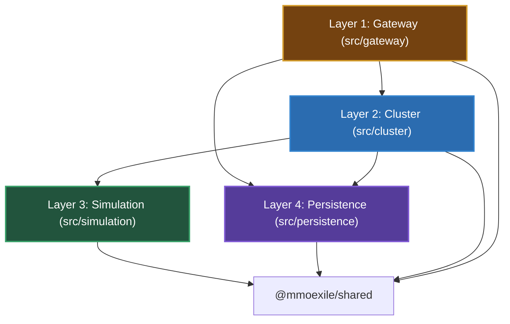
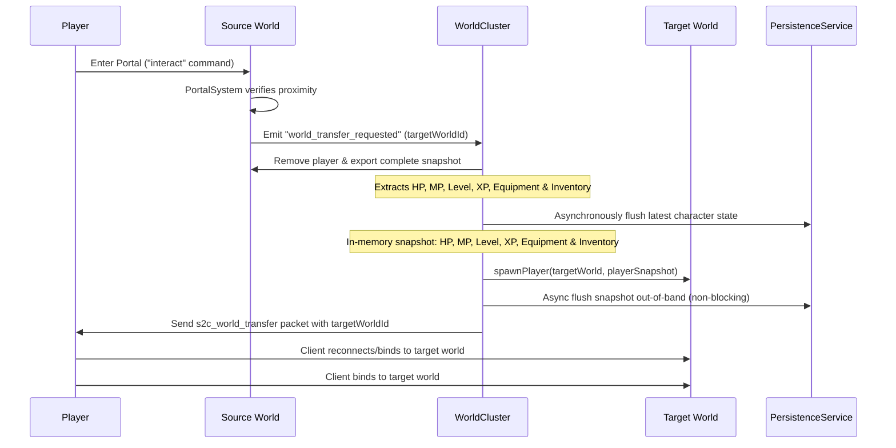
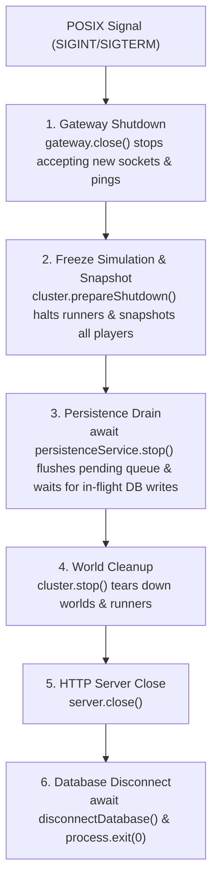

# Server Architecture: 4-Layer MMO Model

This document outlines the architectural design, physical layer boundaries, execution lifecycle, and data flow of the `@mmoexile/server` package.

---

## 1. Architectural Philosophy

The server is architected as an **explicit, decoupled 4-layer MMO engine**. Its primary goals are:
- **Zero I/O in the Simulation Loop**: The game simulation tick loop is 100% synchronous, deterministic, and free of database queries, filesystem I/O, or blocking network calls.
- **Explicit Layer Isolation & Unidirectional Dependencies**: Layers only depend inward towards pure simulation and shared models; outer layers wrap and coordinate inner layers.
- **Lossless World State Transfers**: Players can transition seamlessly between different world instances (e.g. Nexus, Overworld, Dungeons) with 100% preservation of HP, MP, XP, inventory, and equipment.
- **Pluggable Runners for Scalability**: The world execution model is abstracted behind `IWorldRunner`, allowing in-process execution, worker threads, or future multi-process/multi-host clustering without changing simulation code.

---

## 2. Unidirectional Dependency Rules



Strict dependency invariants enforced across the codebase:
1. **Simulation (`src/simulation`)** has **ZERO** dependencies on `gateway`, `cluster`, or `persistence`. It depends strictly on bitECS and `@mmoexile/shared`.
2. **Cluster (`src/cluster`)** coordinates worlds and runners. It depends on `simulation`, `persistence`, and `@mmoexile/shared`. It has no knowledge of WebSocket sockets.
3. **Gateway (`src/gateway`)** terminates client connections and translates packets. It depends on `cluster`, `persistence`, and `@mmoexile/shared`.
4. **Persistence (`src/persistence`)** interacts with Prisma and Postgres. It has no dependencies on `gateway`, `cluster`, or `simulation`.

---

## 3. The 4 Physical Layers

### Layer 1: Network Transport & Gateway (`packages/server/src/gateway/`)
Handles all inbound and outbound network communications.
Handles all inbound and outbound network communications, decoupled from underlying socket transports.

- **`ClientSession`**: Encapsulates a connected player client, tracking connection state, authenticated account/character metadata, ping timestamps, and packet send methods.
- **`transport/ITransportGateway`**: Interface defining pluggable transport gateways (`ITransportGateway`, `ITransportSession`, `ITransportSocket`). Prepares the server to seamlessly support WebRTC DataChannels or WebTransport alongside WebSockets.
- **`ClientSession`**: Implements `ITransportSession`. Encapsulates a connected player client, tracking connection state, authenticated account/character metadata, ping timestamps, and packet send methods without exposing raw socket primitives directly.
- **`SessionManager`**: Maintains the registry of active client sessions indexed by session ID and player/character ID.
- **`WebSocketGateway`**: Attaches to the HTTP/WebSocket server. Handles handshake, binary MessagePack packet decoding, authentication, routing incoming commands to the `WorldCluster`, and dispatching replication snapshots and events back to clients.
- **`WebSocketGateway`**: Implements `ITransportGateway`. Attaches to the HTTP/WebSocket server. Handles handshake, binary MessagePack packet decoding, authentication, routing incoming commands to the `WorldCluster` via the message bus, and dispatching replication snapshots and events back to clients.

### Layer 2: World Cluster & Orchestration (`packages/server/src/cluster/`)
Orchestrates multiple world instances and handles cross-world routing.
Orchestrates multiple world instances and handles cross-world routing, cleanly separated from transport gateways.

- **`messaging/IMessageBus` & `InMemoryMessageBus`**: Pluggable publish-subscribe message broker boundary between Layer 1 (Gateway) and Layer 2 (Simulation Cluster). Allows Gateways and World instances to run in-process or be distributed across separate physical nodes (e.g. via NATS or Redis Pub/Sub) without altering simulation or session logic.
- **`WorldCluster`** (re-exported as `WorldManager` for backward compatibility):
  - Manages the lifecycle of world instances (Nexus, Realm Overworld, Dungeons).
  - Routes player connections and disconnections to the appropriate world runner.
  - Executes lossless world transfers when players step on portals (`transferPlayer()`).
  - Implements `prepareShutdown()` to freeze simulation runners and collect final player snapshots for safe flushing during graceful termination.
  - Periodically collects persistence snapshots from active worlds and flushes them to Layer 4.
- **`runners/IWorldRunner`**: Interface defining the contract for world execution (`start()`, `stop()`, `tick()`, `enqueueCommand()`).
- **`runners/InProcessWorldRunner`**: Default high-performance in-process runner utilizing `setInterval` at 30 ticks per second (33.33ms delta time).

### Layer 3: Deterministic Simulation Engine (`packages/server/src/simulation/`)
Pure, high-performance bitECS game simulation without external I/O.

- **`GameWorld`**: The core simulation container for a world instance. Owns the bitECS world, spatial hash grid, tile map, entity manager, command queue, and tick buffer.
- **`ecs/EntityManager`**: Centralizes entity lifecycle management (`createPlayer`, `createMonster`, `spawnLootBag`, `destroyEntity`), maintaining bidirectional mappings between entity IDs (`eid`) and UUIDs.
- **`ecs/EntityFactory`**: Factory functions for instantiating entities according to declarative prefab definitions from `@mmoexile/shared`.
- **`commands/CommandQueue` & `CommandProcessingSystem`**: Buffers incoming player commands (movement, shooting, inventory swaps, portal entries) and executes them deterministically at the start of each simulation tick.
- **`tick/TickBuffer`**: Accumulates all tick outputs (new projectiles, damage events, deaths, level-ups, portal transfers, loot bag spawns/despawns, snapshots) and returns a consolidated `WorldTickResult` at the end of each tick.
- **`events/EventBus` & `WorldEvents`**: In-simulation typed event bus for decoupling system notifications.
- **11 Modular ECS Systems**:
- **12 Modular ECS Systems**:
  1. `CommandProcessingSystem`: Ingests queued player inputs and actions.
  2. `SpawnerSystem`: Evaluates spawner timers and spawns monsters via `SpawnedBy` relations.
  3. `AISystem`: Runs boss and monster finite state machines (idle, chase, circle, attack phases).
  4. `MovementSystem`: Integrates velocities, pathing intents, and resolves map tile collisions.
  4. `MovementSystem`: Validates client directional intents, caps client delta-time ($dt \in [0, 0.05]$s), bounds velocity by character speed stats, enforces input rate limits (max 2 per tick), and resolves map tile collisions using 2-step sub-stepping to prevent wall tunneling.
  5. `PortalSystem`: Detects player proximity to portals and triggers world transfer requests.
  6. `CombatSystem`: Handles weapon shooting rates, cooldowns, and projectile instantiation.
  6. `CombatSystem`: Handles weapon shooting rates, cooldown timers, and projectile instantiation.
  7. `ProjectileSystem`: Simulates projectile trajectories, ranges, lifetime expiry, and circle-circle collision detection against enemies/players.
  8. `DamageSystem`: Applies armor-mitigated damage calculations with a 15% chip damage floor.
  9. `DeathAndLootSystem`: Handles entity death, drops loot bags with loot-table roll logic, awards XP, and recalculates level-up stat progressions.
  10. `LootSystem`: Manages loot bag expiration, bag tiers (`bag_brown` vs `bag_cyan`), proximity looting, and ground item drops.
  11. `AOISystem`: Generates Area-of-Interest network replication snapshots for all connected players.
  11. `SpatialSystem`: High-speed 2D grid spatial index using zero-allocation 32-bit bitwise cell keys `((cx + 32768) << 16) | ((cy + 32768) & 0xffff)` for fast radius queries without GC pressure.
  12. `AOISystem`: Generates Area-of-Interest network replication snapshots. Caches serialized entity states once per tick and generates per-player filtered snapshots within a 25-tile radius.

### Layer 4: Persistence & Storage (`packages/server/src/persistence/`)
Asynchronous persistence operations running out-of-band from the game loop.

- **`connection.ts`**: Configures and maintains the Prisma client instance.
- **`repositories/AccountRepository`**: Direct database operations on user accounts and credentials.
- **`repositories/CharacterRepository`**: Direct database operations on character records, alive status, inventories, and equipment.
- **`mappers/CharacterMapper`**: Translates between raw Prisma database records and domain `CharacterData` structs, safely parsing JSON inventories and computing effective stats.
- **`accountService.ts`**: High-level authentication, character selection, guest account creation, and death handling.
- **`persistenceService.ts`**: Asynchronous state flushing for player periodic updates, disconnect flushes, and character deaths.
- **`persistenceService.ts`**: Asynchronous state flushing for player periodic updates, disconnect flushes, and character deaths. Features guaranteed shutdown draining (`flush()` and `stop()`) to ensure no character data loss during process termination.

---

## 4. Execution Pipeline & Tick Lifecycle

Each world instance executes at a fixed rate of 30 ticks per second:

```mermaid
sequenceDiagram
    autonumber
    participant Gateway as Layer 1: Gateway
    participant Cluster as Layer 2: Cluster
    participant World as Layer 3: GameWorld
    participant Systems as Layer 3: ECS Systems
    participant Persistence as Layer 4: Persistence

    Gateway->>World: enqueueCommand(playerId, command)
    Note over World: Inputs buffered in CommandQueue

    rect rgb(34, 84, 61)
        Note over World,Systems: Simulation Tick (33.33ms) - Zero I/O
        World->>Systems: 1. CommandProcessingSystem (process buffered inputs)
        World->>Systems: 2. SpawnerSystem (spawn timers & relations)
        World->>Systems: 3. AISystem (FSM phases & attack timers)
        World->>Systems: 4. MovementSystem (velocity integration & tile collision)
        World->>Systems: 5. PortalSystem (portal proximity checks)
        World->>Systems: 6. CombatSystem (weapon cooldowns & shooting)
        World->>Systems: 7. ProjectileSystem (spatial collision & lifetime)
        World->>Systems: 8. DamageSystem (armor mitigation & health updates)
        World->>Systems: 9. DeathAndLootSystem (loot rolls, XP & cleanup)
        World->>Systems: 10. LootSystem (bag decay & ground items)
        World->>Systems: 11. AOISystem (produce replication snapshot)
        World-->>Cluster: Return WorldTickResult
    end

    Cluster->>Gateway: Broadcast snapshots, bullets, damage & deaths to clients
    
    rect rgb(85, 60, 154)
        Note over Cluster,Persistence: Out-of-Band Persistence (Every 5s or on Event)
        Cluster->>World: getPlayerPersistenceStates()
        Cluster->>Persistence: updateCharacterState(playerId, state) (async)
    end
```



---

## 5. Lossless Player World Transfer

When a player enters a portal (e.g. Nexus to Realm Overworld, or Realm to Dungeon):



All character attributes—current HP, max HP, MP, level, XP, inventory contents, and equipped weapon/armor—are fully preserved with zero data loss.
- **Single-Node Execution**: The snapshot transfers directly in-memory from `SourceWorld` to `TargetWorld`. The transfer is instantaneous with zero race conditions between memory and database. The database is updated out-of-band via `PersistenceService` or periodic persistence ticks.
- **Multi-Node Scalability Preparation**: The message broker abstraction (`IMessageBus`) allows scaling across physical instances using distributed locking (e.g., Redis Redlock) and pub/sub transfer handoffs.
- All character attributes—current HP, max HP, MP, level, XP, inventory contents, and equipped weapon/armor—are fully preserved with zero data loss.

---

## 6. Directory Layout
## 6. Graceful Shutdown & Persistence Draining

To ensure complete data integrity during rolling server restarts, deploys, or maintenance, the server traps POSIX signals (`SIGTERM`, `SIGINT`) and follows an explicit multi-stage shutdown sequence:



---

## 7. Directory Layout

```
packages/server/src/
├── cluster/                         # Layer 2: World Cluster & Orchestration
│   ├── index.ts
│   ├── messaging/                   # Decoupled gateway <-> cluster message bus
│   │   ├── IMessageBus.ts
│   │   └── InMemoryMessageBus.ts
│   ├── runners/
│   │   ├── IWorldRunner.ts
│   │   └── InProcessWorldRunner.ts
│   └── WorldCluster.ts              # World instance manager & router
│
├── gateway/                         # Layer 1: Network Transport
│   ├── ClientSession.ts             # Session entity
│   ├── ClientSession.ts             # Session entity implementing ITransportSession
│   ├── index.ts
│   ├── SessionManager.ts            # Client session registry
│   └── WebSocketGateway.ts          # WebSocket & MessagePack protocol
│   ├── transport/                   # Abstract transport layer (WebSocket / WebRTC / WebTransport)
│   │   └── ITransportGateway.ts
│   └── WebSocketGateway.ts          # WebSocket & MessagePack implementation
│
├── persistence/                     # Layer 4: Storage & Database
│   ├── accountService.ts            # High-level auth & account operations
│   ├── connection.ts                # Prisma database client
│   ├── index.ts
│   ├── mappers/
│   │   └── characterMapper.ts       # Prisma to domain mapping
│   ├── persistenceService.ts        # Out-of-band database flushes
│   ├── persistenceService.ts        # Out-of-band database flushes with drain & shutdown
│   └── repositories/
│       ├── accountRepository.ts
│       └── characterRepository.ts
│
├── simulation/                      # Layer 3: Deterministic Simulation Engine
│   ├── commands/
│   │   ├── CommandQueue.ts
│   │   └── PlayerCommand.ts
│   ├── ecs/
│   │   ├── EntityFactory.ts         # Prefab instantiation
│   │   └── EntityManager.ts         # Entity lifecycle & spatial index
│   ├── events/
│   │   ├── EventBus.ts              # Typed simulation event bus
│   │   └── WorldEvents.ts           # Event payload definitions
│   ├── GameWorld.ts                 # Core simulation container
│   ├── index.ts
│   ├── systems/                     # 11 bitECS simulation systems
│   ├── systems/                     # 12 bitECS simulation systems
│   │   ├── AISystem.ts
│   │   ├── AOISystem.ts
│   │   ├── CombatSystem.ts
│   │   ├── CommandProcessingSystem.ts
│   │   ├── DamageSystem.ts
│   │   ├── DeathAndLootSystem.ts
│   │   ├── InventorySystem.ts
│   │   ├── ISystem.ts
│   │   ├── LootSystem.ts
│   │   ├── MovementSystem.ts
│   │   ├── PortalSystem.ts
│   │   ├── ProjectileSystem.ts
│   │   ├── SpatialSystem.ts
│   │   └── SpawnerSystem.ts
│   └── tick/
│       └── TickBuffer.ts            # Synchronous tick delta collector
│
├── __tests__/                       # Integration & architecture tests
│   └── server.test.ts
│   ├── server.test.ts               # Functional integration test suite (29 tests)
│   └── simulation.bench.test.ts     # Headless vertical slice benchmark (100 players, 500 monsters)
│
├── ARCHITECTURE.md                  # This architecture specification
└── index.ts                         # Server entry point
```

