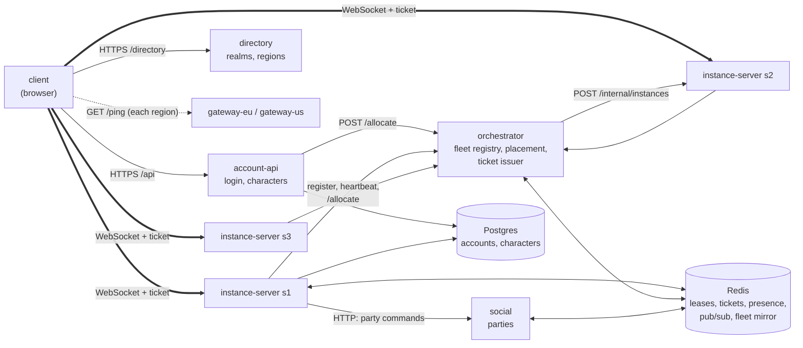
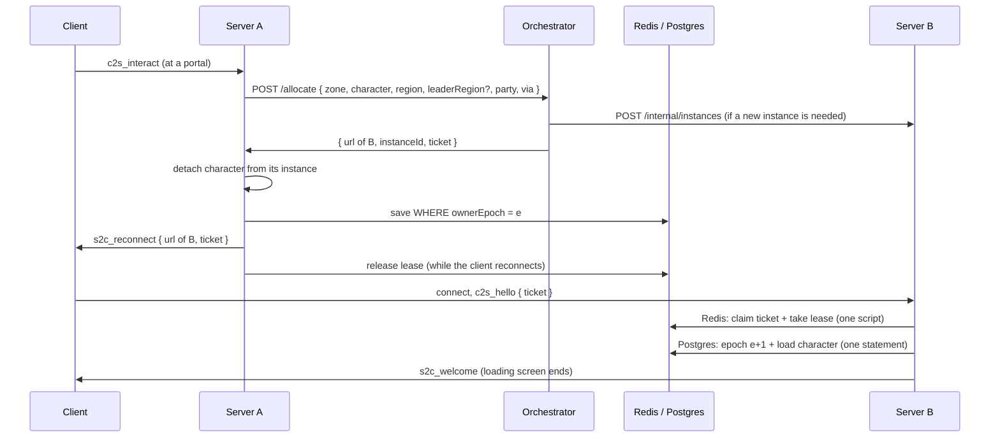
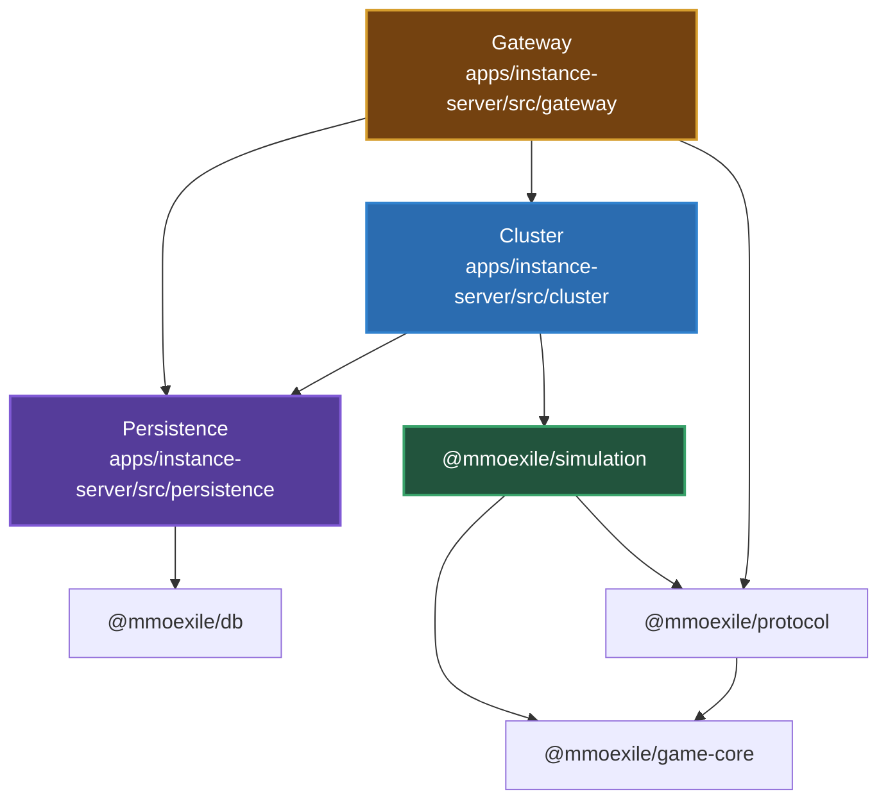
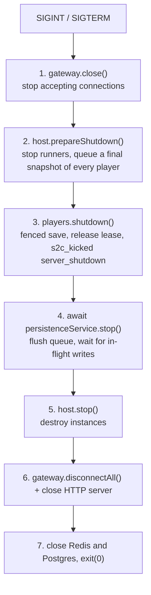

# Game Server Architecture

This document describes how the game works **today**: the services of a realm, how a character connects and moves between servers, the layers inside `@mmoexile/instance-server`, the pure packages it builds on, the tick lifecycle, and shutdown. For the target multi-service infrastructure (realms, gateways, orchestrator, handoffs) see [`SERVER_INFRASTRUCTURE.md`](../SERVER_INFRASTRUCTURE.md); for the migration plan see [`SERVER_INFRASTRUCTURE_PLAN.md`](../SERVER_INFRASTRUCTURE_PLAN.md).

---

## 1. Architectural Philosophy

- **Zero I/O in the simulation loop**: the tick is synchronous and free of database queries, filesystem access, and network calls.
- **Unidirectional dependencies**: outer layers wrap inner layers; the simulation knows nothing about sockets or databases.
- **Lossless world transfers**: players move between worlds (Nexus, Realm, Dungeon) with HP, XP, inventory, and equipment preserved.
- **Pluggable runners**: world execution sits behind `IWorldRunner`, so how a world is driven can change without touching simulation code.

---

## 2. Services of a Realm



| Service | Owns | Talks to |
| :--- | :--- | :--- |
| `account-api` (`:3000`) | `Account`, `Character` rows (create/delete) | Postgres; signs session tokens; asks the orchestrator for the first ticket |
| `orchestrator` (`:3003`, internal) | The fleet registry (servers, instances, load) and the ticket signing key | Instance servers' internal APIs; Redis (registry mirror) |
| `directory` (`:3004`) | Nothing (stateless): the realm and its regions from the `REGIONS` setting | Nobody; the client calls `GET /realms` |
| `gateway-<region>` (Docker: `:7100` eu, `:7200` us) | Nothing: answers `GET /ping` from the region's network position | — |
| `instance-server` (`SERVER_ID`; `:3001` + internal `:9001` in dev, `:7001`–`:7003` in Docker) | The instances placed on it; gameplay columns of characters it holds the lease for | Postgres (fenced writes), Redis, social, orchestrator |
| `social` (`:3002`) | Parties (in Redis) | Redis; publishes `party.updated` |
| `client` | — | directory and account-api over HTTP, each region's gateway (ping), one instance server at a time over WebSocket |

Instance servers are **generic**: any server hosts any zone. Each keeps one warm nexus; every other instance is created where the orchestrator decides. Each server has two ports: the public WebSocket port that clients connect to directly, and an internal HTTP port (instance creation, `/metrics`) that only the orchestrator and Prometheus reach.

### The orchestrator

- **Registry** (`Registry.ts`): every server with its state, capacity, tick p95, CPU and instances (zone, owner party or portal, players). It lives in memory, is mirrored to Redis, and is rebuilt from heartbeats: a heartbeat from an unknown server registers it, so a restarted orchestrator knows the whole fleet again within one interval (2 s). Restarting it never disconnects a player, since clients talk to instance servers directly.
- **Liveness**: servers report every 2 s and immediately when instances are created or closed. Three missed heartbeats (6 s) mark a server `dead`: it gets no players, and its instances are dropped from the registry.
- **Allocation** (`Allocator.ts`, `placement.ts`): `POST /allocate { zoneId, characterId, accountId, partyId?, via?, preferInstanceId?, excludeServerId? }` applies the zone's access policy across the whole fleet: fill the fullest public shard below its soft cap, or find the party's or portal's existing instance. Otherwise it creates one on the best `ready` server: lowest `players + 5 × instances`, plus a penalty when tick p95 exceeds 20 ms; never draining, dead, full or excluded servers. Decisions for the same zone and owner are serialized, so a party arriving together gets one instance. Players on their way count as "reservations" until the next heartbeat covers them.
- **Tickets**: the orchestrator is the only issuer. Tickets are Ed25519 JWTs naming character, zone, **instance**, target server and the player's **home region**; instance servers only have the public key, so a compromised instance server cannot mint tickets.

### Regions

Every instance server runs in one region (`REGION`, e.g. `eu`, `us`); its instances are in that region. Central services (account-api, orchestrator, social, directory, Postgres, Redis) exist once.

- **Choosing**: the client loads the regions from the directory, pings each region's gateway five times (median of the last four) and preselects the fastest. `/play { characterId, region }` makes that region the player's **home region** for the session. It is not stored anywhere: it travels in every ticket, and instance servers pass it on with every allocation.
- **Placement** (`targetRegion()` in `placement.ts`): public zones (hubs) are placed in the home region only, so there are separate hub shards per region. A party's private instance is created in the **leader's** home region (looked up via presence) and joined from any region. A `portal_bound` instance follows the region of its portal. Without capacity in the target region the orchestrator answers `503 { reason: "region_unavailable" }`; there is no silent spill-over, the client asks the player to pick another region.
- **Distance**: in Docker, `region-us` owns the US services' network namespace and delays everything they send with `tc netem` (`US_LATENCY_MS`, default 40); in Kubernetes the whole `us` cluster (its node) is delayed the same way. Every sequential trip from a US server to Redis or Postgres costs that much, so admission is kept to two (see "Ownership and players").

### Server lifecycle and draining

`starting → ready → draining → stopped` (plus `dead`, decided by the orchestrator).

**Who manages the process** (`LIFECYCLE`):
- `orchestrator` (default: `pnpm dev`, compose, tests): the process is started and stopped from outside (by hand, Docker); it only reports to the orchestrator.
- `agones` (Kubernetes, [`infra/k8s/README.md`](../infra/k8s/README.md)): the server is a GameServer in a per-region Agones Fleet. It still registers and sends heartbeats to the orchestrator, which still places every player. In addition it talks to the Agones SDK sidecar (`fleet/AgonesSdk.ts`, `fleet/AgonesLifecycle.ts`): it takes its public URL from the host port Agones assigned; it is **Allocated** while it has players or a hold, **Ready** when empty (Agones scales down and replaces only Ready servers); it mirrors its player count into the `players` Counter that the FleetAutoscaler keeps a buffer of; it pings Health; and it calls Shutdown after stopping. A **hold** covers players on their way: the server becomes Allocated before it answers a create-instance call, and the heartbeat answer carries `hold` for 15 s after the orchestrator sent a player there.

### Deployment targets

| Target | Command | What runs the processes |
| :--- | :--- | :--- |
| Local processes | `pnpm dev` | pnpm, one of each service, region `local` |
| Docker Compose | `pnpm realm:up` | Docker: three instance servers in two regions, gateways, Prometheus/Grafana |
| Kubernetes + Agones + Linkerd | `pnpm cluster:up` | three kind clusters: `central` (Deployments for the central services, Prometheus and Grafana) and one per region (an Agones Fleet with autoscaling, a Prometheus agent), connected by the Linkerd service mesh; Postgres (behind PgBouncer) and Redis next to the clusters like managed databases (`pnpm cluster-db:up`) |

Compose and Kubernetes use the same images and environment variables; only the plumbing differs (see `infra/compose` and `infra/k8s`). In the cluster the connections are TLS-verified against a local CA (`DATABASE_URL` with `sslaccept=strict`, `REDIS_URL=rediss://…` with `REDIS_CA_FILE`), the services use a database user that can't change the schema (migrations run as another), and each process has an explicit pool size (`DATABASE_POOL_SIZE`).

### Database outages

There is one Postgres and one Redis per realm (no high availability). A short outage must not kick anyone:
- **Every database call times out** (`DATABASE_TIMEOUT_SEC`, 5 s: Prisma's `socket_timeout`/`pool_timeout`, plus `withDatabaseTimeout` for what those don't cover); `isDatabaseUnavailable()` tells "try again later" from real errors.
- **Saves are kept and retried** (`PersistenceService`): with backoff (1 s doubling to 10 s); deaths first, then final saves, then snapshots, newest state wins. `available` is false from the first failed write until one succeeds.
- **Leaving keeps the lease** until the final save is written, so no other server can load an older state meanwhile.
- **Zone changes** are refused with a chat message while the database is known to be down (the player stays). One that runs into the outage waits, frozen, for its save (up to 60 s) and gets a fresh ticket if that took long; only after 60 s is the player asked to join again (`service_unavailable`).
- **Logins** get `503` with a clear message from account-api. Readiness doesn't depend on shared databases: an outage would otherwise take every pod out of the load balancer at once.
- **Redis**: a pause shorter than the lease (30 s) only delays commands. If Redis restarts empty, lease renewal takes vanished leases back (safe: the fencing epoch protects the data); presence, parties and pub/sub messages in flight are lost. Background calls can't crash a server (every service logs unhandled rejections instead of exiting).

**Draining** (`fleet/Drainer.ts`) starts on SIGTERM (`docker compose stop`, Kubernetes deleting the pod: scale-down, rolling update) or `POST /servers/:id/drain` at the orchestrator:
1. The server reports `draining`; the orchestrator places nobody there any more.
2. Players in public hubs are handed off to shards on other servers right away.
3. Private instances (dungeons) may finish until `DRAIN_TIMEOUT_SEC`; then their players are handed off to a nexus elsewhere.
4. Once empty the server stops (saving and releasing everything that is left) and exits with 0.

SIGINT (Ctrl-C in development), or a second signal during a drain, skips draining and shuts down immediately.

### Clusters and the service mesh

In Kubernetes (Stage 7, [`infra/k8s/README.md`](../infra/k8s/README.md)) each region is its own cluster, and services call each other across clusters through **Linkerd**: every pod has a proxy, calls between proxies are mutual TLS with the pod's ServiceAccount as its identity, and policies allow only the intended calls (deny by default). A cluster reaches another's exported Services as mirrored copies named `<service>-<cluster>` (e.g. `orchestrator-central` in eu), through the clusters' gateways. Players' connections stay outside the mesh. Two things changed for the services, both configuration only:
- instance servers call `ORCHESTRATOR_URL=http://orchestrator-central:3003` and `SOCIAL_URL=http://social-central:3002`;
- the orchestrator can't reach a pod in another cluster, so each region's gateway has an **entry point** that forwards `/servers/<id>/…` to that server's internal API, and instance servers register `internalUrl = http://region-gateway-<region>:9000/servers/<id>`.

`pnpm dev`, compose and the tests have no mesh: plain HTTP on one network, as before.

### When a region fails

A region depends on central for placement (the orchestrator) and parties (social); it doesn't need central to keep playing. What happens (`pnpm cluster:smoke` checks both cases):
- **A region's cluster is lost**: its servers miss their heartbeats and are marked `dead` within ~6 s; logins choosing that region get `503 region_unavailable`; other regions are unaffected. Its players lost their connection. When the cluster is back, new servers register and the region works again on its own.
- **A region is cut off from central** (both clusters run, the link between them doesn't): players there keep playing and saving (the databases are reachable from both). The orchestrator marks the region's servers dead, so logins into it get `503 region_unavailable`. On the servers, a failed heartbeat means "central unreachable" (`FleetAgent.reachable`): zone changes are refused right away with a chat message, and nobody is kicked (D35: there is no second placement path, a region doesn't decide alone). When the link is back, the first heartbeat revives each server in the registry with its instances; nothing has to be reconciled.
- **Central is lost**: every region is cut off at once, and nobody can log in (account-api is central); players already in a region keep playing.
- Party commands fail with "That didn't work. Please try again in a moment." while social is unreachable.

---

## 3. Connection Flow, Handoff and Ownership

**Login.** The client signs in at `account-api`, picks a character, and `POST /play` asks the orchestrator to allocate a nexus slot. It returns the server's URL plus a 30-second transfer ticket for exactly that server and instance. The client connects and sends `c2s_hello { ticket, protocolVersion }`. `PlayerLifecycle.admit()` on the instance server:

1. verifies the ticket's signature (Ed25519 public key), expiry and target server;
2. in **one Redis round trip** (a script), claims the ticket id once (no replays) and takes the character's **ownership lease** (`lease:char:<id>`, `SET NX`, 30 s, renewed every 10 s);
3. in **one Postgres round trip**, increments `Character.ownerEpoch` and loads the character with its account's nickname (`UPDATE … RETURNING`, so it reads the latest save), puts it into the instance named on the ticket (if that instance closed in the meantime, the local placement rules create an equivalent one), and sends `s2c_welcome`.

If someone else holds the lease, the newest login wins: the holder is asked to leave via `session.kick` (it saves and releases), and after 5 s the new server takes over by force.

**Every zone change is a handoff**, also within one server (decision D4):



Allocation happens before the character is frozen: if the orchestrator is unreachable or the region is full (`region_unavailable`), the player stays where they are and gets a chat notice. The ticket ID appears in the logs of account-api or the source server, the orchestrator, and the target server, which ties one handoff together across services.

**Fencing.** Every save is `UPDATE … WHERE ownerEpoch = <my epoch>`. A server that lost its lease without noticing (paused process, network split) writes 0 rows, drops the character, and kicks the session. A crashed server's characters become claimable once its leases expire (or immediately via forced takeover on the next login).

---

## 4. Packages and Layers

The server is split across one app and several workspace packages. Dependency rules are enforced by `pnpm lint:deps` (see `.dependency-cruiser.cjs`).



| Package | Contents | May depend on |
| :--- | :--- | :--- |
| `@mmoexile/game-core` | Math, maps, items, prefabs, character progression, combat formulas, ECS component definitions, voxel models | nothing internal |
| `@mmoexile/protocol` | Client ⇄ server packets, replication snapshot shapes, MessagePack serialization | `game-core` |
| `@mmoexile/simulation` | `GameWorld`, ECS systems, command queue, tick buffer | `game-core`, `protocol`, `bitecs` |
| `@mmoexile/db` | Prisma schema and client | `@prisma/client` |
| `@mmoexile/instance-server` | Gateway, cluster, persistence, entry point | all of the above |

Invariants:

1. **Simulation** has no dependency on gateway, cluster, persistence, or any Node built-in. It also runs in a browser.
2. **Cluster** coordinates worlds and runners; it has no knowledge of sockets.
3. **Gateway** terminates client connections and translates packets into commands.
4. **Persistence** talks to the database and knows nothing about gateway, cluster, or simulation.

---

## 5. The Layers in Detail

### Gateway (`apps/instance-server/src/gateway/`)

Network transport, decoupled from the concrete socket implementation.

- **`transport/ITransportGateway`**: interfaces (`ITransportGateway`, `ITransportSession`, `ITransportSocket`) that would allow WebRTC DataChannels or WebTransport alongside WebSockets.
- **`ClientSession`**: implements `ITransportSession`. Tracks connection state, account/character metadata, and ping timestamps, and sends packets without exposing the raw socket.
- **`SessionManager`**: registry of active sessions, indexed by session ID and player ID.
- **`WebSocketGateway`**: implements `ITransportGateway`. Hands `c2s_hello` to `PlayerLifecycle.admit()`, decodes MessagePack, routes commands to the host via the message bus, dispatches snapshots and events, forwards shared chat from the broker, and sends `s2c_reconnect` / `s2c_kicked`. Snapshots go through `SnapshotEncoder` (`@mmoexile/protocol`): every entity is MessagePack-encoded once per tick and each player's packet is assembled from the cached bytes (byte-for-byte what `serializePacket` would produce). Encoding per player was about 70 % of a loaded server's CPU.

### Cluster (`apps/instance-server/src/cluster/`)

Hosts the instances of this process and routes players between them.

- **`Instance`**: one live copy of a zone: `id` (`"<zoneId>:<6 hex>"`, e.g. `golem_dungeon:7f3a9c`), `zone`, the `GameWorld`, its runner, `players`, optional `ownerPartyId`, `state` (`creating`/`running`/`empty`/`closed`/`crashed`; only `running` instances tick), `createdAt`, `emptySince`.
- **`InstanceManager`** (implements `InstanceDirectory`): placement by the zone's access policy.
  - `public_sharded` (nexus, overworld): a preferred instance if below the hard cap, else the fullest instance below the soft cap, else a new shard.
  - `party_private` (golem dungeon): one instance per party; solo players are the party `solo:<characterId>`.
  - `portal_bound`: one instance per `<sourceInstanceId>/<portalId>`, shared by everyone using that portal.
- **`messaging/IMessageBus` + `InMemoryMessageBus`**: in-process publish/subscribe between gateway and host (commands in; tick results, transfers, chat, deaths out).
- **`InstanceHost`**:
  - Creates instances from zones (`createInstance(zoneId, { id?, ownerPartyId?, boundPortalKey? })`). At startup only warm instances exist (one `nexus`); everything else is created when the orchestrator allocates it (`POST /internal/instances`).
  - Puts an arriving character into the instance named on its ticket; if that instance is gone, delegates to an `InstanceDirectory` (default: `InstanceManager`), which creates an equivalent one.
  - **Sleeping:** an instance ticks only while players are inside. When the last player leaves, its runner stops; the next player to enter starts it again. Private instances are kept for re-entry for minutes, and ticking them empty used to take most of a server's CPU.
  - **Lifecycle:** `sweepIdleInstances()` runs every second outside the tick loops and closes instances that have been empty longer than their zone's `emptyTimeoutSec`, keeping `minWarmInstances`. `closeInstance()` stops the runner and destroys the world, releasing its entity IDs.
  - **Fault isolation:** each runner wraps its tick in an error boundary. If an instance's tick throws, `handleInstanceCrash()` saves its players, moves them to a nexus shard with a private system message, and closes the instance as `crashed`; other instances keep running.
  - Registers and unregisters players (`registerPlayer({ playerId, name, zoneId, character })`), forwards their commands.
  - Moves players between instances (`transferPlayer(playerId, targetZoneId)`).
  - Queues periodic persistence every 150 ticks (5 s).
  - `prepareShutdown()` freezes all runners and snapshots every player for the final flush.
- **`runners/IWorldRunner`**: contract for driving a world (`start()`, `stop()`, `step()`).
- **`runners/InProcessWorldRunner`**: drives a world with `setInterval` at 30 Hz on the main thread, with an error boundary around every tick, and reports each tick's duration and the interval since the previous tick. This is currently the only runner; all worlds share the main thread, so the event loop utilization (reported to the orchestrator) is what limits a server.

### Parties, presence and chat (`src/party/`, `src/presence/`, `src/chat/`)

- **`PartyDirectory`**: party operations. `SocialPartyDirectory` calls the `social` service; `InMemoryPartyDirectory` applies the same rules in memory (tests).
- **`PartyCache`**: local party membership, kept current by `party.updated` broker messages, so placement can look up a character's party synchronously.
- **`Presence`**: who is online under which name, in Redis (refreshed every 20 s), so `/invite <name>` finds players on any server.
- **`ChatCommands`**: `/invite <name>`, `/accept`, `/leave`, `/party`, `/g <text>` and `/p <text>`. Replies to the issuer are local; party notices and `/p` go through `chat.party`, `/g` and global system messages (logins, deaths) through `chat.global`, so they reach every server.
- **Chat scopes**: plain chat stays in the sender's instance; level-ups go to the instance, zone entries to the entered instance. Every `s2c_chat` carries a `channel` (`local`, `global`, `party`) that the client shows as a prefix.
- Disconnecting leaves the party; handoffs and kicks don't.

### Ownership and players (`src/ownership/`, `src/players/`)

- **`CharacterOwnership`**: lease acquire / force / renew / release, and `writeFenced()`. Every step is one round trip, because instance servers may be far from Redis and Postgres: `acquire` claims the ticket and the lease in one Redis script and bumps the epoch and loads the character in one SQL statement; `writeFenced` is a single `UPDATE` (Prisma's `updateMany` would add `BEGIN`/`COMMIT`).
- **`LeaseKeeper`**: renews all held leases and reports lost ones.
- **`FencedCharacterWriter`**: the database writer behind `PersistenceService`; skips characters we don't own and drops fenced ones.
- **`PlayerLifecycle`**: admit, hand off, leave, kick, drop when fenced, shutdown (see §3).
- **`server.ts`** (`createInstanceServer`) wires everything; `main.ts` adds config, Redis, Postgres and signal handling.

### Fleet (`src/fleet/`)

- **`FleetAgent`**: registers with the orchestrator, sends heartbeats (state, instances, tick p95, CPU) every 2 s and right after instances are created or closed, and passes on drain requests. If the orchestrator is down, players keep playing; only zone changes wait for it.
- **`ZoneAllocator`**: `POST /allocate` at the orchestrator, used by every handoff.
- **`Drainer`**: empties the server before it stops (see §2).
- **`AgonesSdk`**, **`AgonesLifecycle`** (`LIFECYCLE=agones` only): the Agones SDK sidecar's REST API and the rules for Ready/Allocated, holds, the `players` Counter, health and Shutdown (see §2).
- **`internalApi.ts`**: the internal port: `POST /internal/instances` (the orchestrator creates an instance with an ID it chose), `/metrics`, `/health`, `/ready`.

### Simulation (`packages/simulation/src/`)

Pure bitECS game simulation.

- **`GameWorld`**: the simulation container for one world. Owns the bitECS world, spatial grid, tile map, entity manager, command queue, and tick buffer.
- **`ecs/EntityManager`**: entity lifecycle (players, monsters, projectiles, loot bags), including the mapping between bitECS entity IDs (`eid`) and UUIDs.
- **`ecs/EntityFactory`**: instantiates entities from the declarative prefabs in `@mmoexile/game-core`.
- **`commands/CommandQueue` + `CommandProcessingSystem`**: buffers player commands (movement, shooting, interaction, inventory) and applies them at the start of each tick.
- **`tick/TickBuffer`**: collects the tick's outputs (projectiles, damage, deaths, level-ups, transfers, loot bags, snapshot) into one `WorldTickResult`.
- **`events/EventBus` + `WorldEvents`**: typed in-simulation event bus.

**Systems, in tick order:**

| # | System | Responsibility |
| :-- | :--- | :--- |
| 1 | `CommandProcessingSystem` | Applies queued player commands. |
| 2 | `SpawnerSystem` | Spawner timers; spawns monsters linked via the `SpawnedBy` relation. |
| 3 | `MonsterAISystem` | Monster and boss state machines, attack phases. |
| 4 | `MovementSystem` | Validates movement intents (clamps `dt` to [0, 0.05] s, caps speed, max 2 inputs per tick) and resolves tile collisions, sub-stepping (up to 2 steps) to prevent wall tunneling. Its `handleInteract()` detects portal use (within 1.8 tiles) when an `interact` command is processed. |
| 5 | `SpatialSystem` | 2D grid spatial index with packed 32-bit cell keys for allocation-free radius queries. |
| 6 | `CombatSystem` | Weapon cooldowns, projectile spawning, projectile lifetime, and hit detection via spatial queries. |
| 7 | `DamageSystem` | Armor-mitigated damage with a 15% chip-damage floor. |
| 8 | `DeathAndLootSystem` | Deaths, loot-table rolls, XP awards, level-ups. |
| 9 | `LootSystem` | Loot bag expiry, bag tiers, proximity looting, ground drops. |
| 10 | `AOISystem` | Per-player area-of-interest snapshots (25-tile radius), serializing each entity state once per tick. |

`InventorySystem` is not part of the tick; it is called by command handlers for equip, unequip, swap, and drop.

### Persistence (`apps/instance-server/src/persistence/` + `@mmoexile/db`)

Asynchronous persistence, out of band from the game loop, backed by PostgreSQL (`pnpm db:up` starts it via `infra/compose`). Schema changes go through committed Prisma migrations (`packages/db/prisma/migrations`). Characters store `lastZoneId` (a zone, never an instance) and their inventory as `jsonb`.

- **`@mmoexile/db`**: Prisma schema, migrations, and the client (generated into `packages/db/generated/` so it ships with the package in Docker images).
- **`mappers/characterMapper`**: converts between Prisma records and the domain `CharacterData`.
- **`persistenceService`**: batched background saves, immediate saves, death records, final saves, and a draining `stop()` for shutdown. While the database is unavailable it keeps failed writes and retries them with backoff (see "Database outages"). Writes go through a `CharacterWriter`; the instance server uses the `FencedCharacterWriter`, so only the lease holder can write.
- Accounts and character creation live in `account-api`, not here.

---

### HTTP endpoints

Public port (`src/http.ts`, next to the WebSocket endpoint):

- `GET /health`: status, uptime, number of instances and players.
- `GET /debug/instances` (disabled when `NODE_ENV=production`): every instance with id, zone, state, players, owner party, age, time spent empty, and current tick.

Internal port (`src/internalApi.ts`, `INTERNAL_PORT`, never published): see Fleet above.

### Metrics

Every service serves Prometheus metrics on `/metrics` (`service-kit`'s `createMetrics`: process metrics plus service metrics). Instance servers: `mmoexile_players`, `mmoexile_instances{zone}`, `mmoexile_tick_duration_seconds`, `mmoexile_tick_interval_seconds` (time between two ticks of one instance: 33 ms while the server keeps up), `mmoexile_event_loop_utilization`, `mmoexile_handoff_duration_seconds{kind,from_region,to_region}` (ticket issue to admission, including the client's reconnect), `mmoexile_lease_conflicts_total`, `mmoexile_fenced_writes_total`, `mmoexile_ticket_rejections_total{reason}`, `mmoexile_character_write_seconds` (one fenced `UPDATE`: the database as the server sees it), `mmoexile_character_save_failures_total{kind,retrying}`, `mmoexile_character_saves_pending` (waiting for the database). Every instance-server metric also carries `server` and `region`. Orchestrator: `mmoexile_allocation_duration_seconds{created}`, `mmoexile_allocation_failures_total{status,reason,region}`, and per-server gauges from the heartbeats (`mmoexile_fleet_server_players`, `…_instances`, `…_tick_p95_seconds`, `mmoexile_fleet_servers{state,region}`). account-api: `mmoexile_play_requests_total{result,region}`. The dashboard has a region filter, a "Regions" row and a "Databases" row (Postgres, PgBouncer and Redis exporters: connections, pool, transactions, commands, write latency, saves waiting). The Docker realm provisions Prometheus and a Grafana "Realm Overview" dashboard (`infra/observability/`).

---

## 6. Tick Lifecycle

Each world ticks at 30 Hz:

```mermaid
sequenceDiagram
    autonumber
    participant Gateway
    participant Cluster
    participant World as GameWorld
    participant Systems as ECS Systems
    participant Persistence

    Gateway->>World: enqueueCommand(playerId, command)
    Note over World: Buffered in CommandQueue

    rect rgb(34, 84, 61)
        Note over World,Systems: Simulation tick (33.33 ms budget), zero I/O
        World->>Systems: CommandProcessing → Spawner → MonsterAI → Movement → Spatial
        World->>Systems: Combat → Damage → DeathAndLoot → Loot → AOI
        World-->>Cluster: WorldTickResult
    end

    Cluster->>Gateway: Snapshots, projectiles, damage, transfers, chat

    rect rgb(85, 60, 154)
        Note over Cluster,Persistence: Out of band (every 150 ticks, on disconnect, on death)
        Cluster->>World: getPlayerPersistenceStates()
        Cluster->>Persistence: queueSave(charId, state)
    end
```



---

## 7. Character State and Transfers

- Handoffs (§3), periodic saves (every 150 ticks) and crash evacuations all use one `CharacterSnapshot` (`snapshotCharacter()` in `@mmoexile/simulation`), so they can never disagree about what a character's state is.
- Characters store their zone (`lastZoneId`), never an instance id; logins always start in a nexus shard.
- MP is not simulated yet (no mana component); snapshots omit it so the persisted value is left untouched.
- `InstanceHost.transferPlayer()` (an in-memory move) still exists for tests and single-process setups; the instance server replaces it with the handoff via `onPortalTransfer`.

---

## 8. Graceful Shutdown

On `SIGTERM` the server first drains (§2); on `SIGINT`, after a drain, or on a second signal it runs `gracefulShutdown()` (`apps/instance-server/src/shutdown.ts`). It first reports `draining` so the orchestrator stops sending players, and afterwards reports `stopped`. The order guarantees that every online player is saved before the instances holding their state are destroyed:



If a step fails, the sequence stops before destroying instances and the process exits with code 1. A 10-second timer force-exits if any step hangs (the drain before it has its own limit, `DRAIN_TIMEOUT_SEC` + 30 s). The order is covered by `__tests__/shutdown.test.ts`.

---

## 9. Directory Layout

```
apps/instance-server/src/
├── cluster/
│   ├── messaging/            # IMessageBus, InMemoryMessageBus
│   ├── runners/              # IWorldRunner, InProcessWorldRunner
│   ├── Instance.ts
│   ├── InstanceHost.ts
│   ├── InstanceManager.ts
│   └── index.ts
├── gateway/
│   ├── transport/            # ITransportGateway interfaces
│   ├── ClientSession.ts
│   ├── SessionManager.ts
│   ├── WebSocketGateway.ts
│   └── index.ts
├── chat/                     # ChatCommands (slash commands)
├── fleet/                    # FleetAgent, ZoneAllocator, Drainer, AgonesSdk, AgonesLifecycle
├── ownership/                # CharacterOwnership, LeaseKeeper, FencedCharacterWriter
├── party/                    # PartyDirectory, PartyCache
├── players/                  # PlayerLifecycle (admit, handoff, leave, kick)
├── presence/                 # Presence (Redis / in memory)
├── persistence/
│   ├── mappers/              # characterMapper
│   ├── persistenceService.ts
│   └── index.ts
├── __tests__/                # host, placement, lifecycle, ownership, parties, fleet agent, two-server handoff
├── http.ts                   # public port: /health and /debug/instances
├── internalApi.ts            # internal port: /internal/instances, /metrics
├── metrics.ts                # Prometheus metrics
├── shutdown.ts               # graceful shutdown sequence
├── config.ts                 # environment (SERVER_ID, PUBLIC_URL, ORCHESTRATOR_URL, LIFECYCLE, …)
├── server.ts                 # createInstanceServer: composition root
└── main.ts                   # entry point: config, Redis, Postgres, signals (SIGTERM drains)

apps/orchestrator/src/
├── Registry.ts               # servers and instances, heartbeats, dead detection, holds
├── RegistryMirror.ts         # copy in Redis for warm restarts
├── placement.ts              # pure placement rules and server scoring
├── Allocator.ts              # /allocate: find or create an instance, sign the ticket
├── metrics.ts                # allocation and fleet metrics
├── app.ts                    # HTTP API (register, heartbeat, drain, servers, allocate)
└── main.ts

apps/directory/src/
├── config.ts                 # REALM_NAME, ACCOUNT_API_URL, REGIONS (id=Name=pingUrl,…)
├── app.ts                    # GET /realms, GET /ping (fallback for single-region dev)
└── main.ts

packages/simulation/src/
├── commands/                 # CommandQueue, PlayerCommand
├── ecs/                      # EntityFactory, EntityManager
├── events/                   # EventBus, WorldEvents
├── systems/                  # the 10 tick systems + InventorySystem
├── tick/                     # TickBuffer
├── __tests__/                # simulation tests + 100-player / 500-monster benchmark
├── GameWorld.ts
└── index.ts
```
