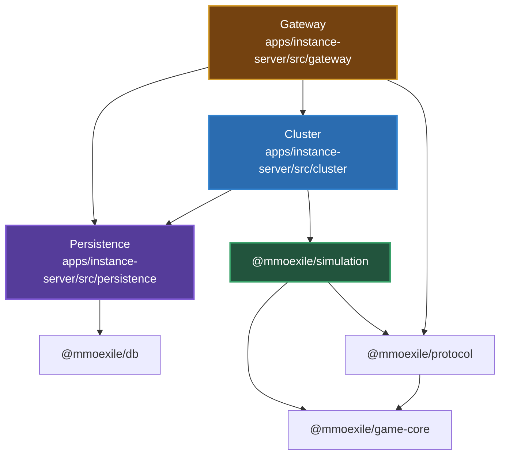
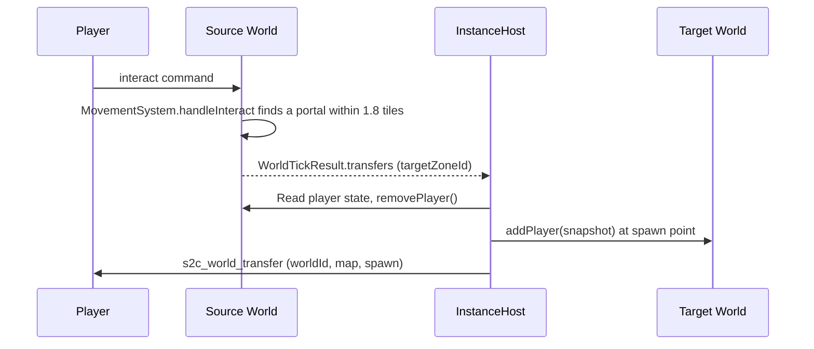
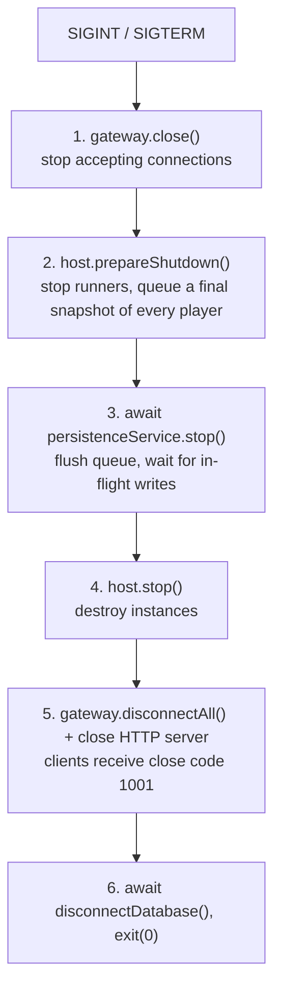

# Game Server Architecture

This document describes how the game server works **today**: the layers inside `@mmoexile/instance-server`, the pure packages it builds on, the tick lifecycle, world transfers, and shutdown. For the target multi-service infrastructure (realms, gateways, orchestrator, handoffs) see [`SERVER_INFRASTRUCTURE.md`](../SERVER_INFRASTRUCTURE.md); for the migration plan see [`SERVER_INFRASTRUCTURE_PLAN.md`](../SERVER_INFRASTRUCTURE_PLAN.md).

---

## 1. Architectural Philosophy

- **Zero I/O in the simulation loop**: the tick is synchronous and free of database queries, filesystem access, and network calls.
- **Unidirectional dependencies**: outer layers wrap inner layers; the simulation knows nothing about sockets or databases.
- **Lossless world transfers**: players move between worlds (Nexus, Realm, Dungeon) with HP, XP, inventory, and equipment preserved.
- **Pluggable runners**: world execution sits behind `IWorldRunner`, so how a world is driven can change without touching simulation code.

---

## 2. Packages and Layers

The server is split across one app and several workspace packages. Dependency rules are enforced by `pnpm lint:deps` (see `.dependency-cruiser.cjs`).



| Package | Contents | May depend on |
| :--- | :--- | :--- |
| `@mmoexile/game-core` | Math, maps, items, prefabs, character progression, combat formulas, ECS component definitions, voxel models | nothing internal |
| `@mmoexile/protocol` | Client ⇄ server packets, replication snapshot shapes, MessagePack serialization | `game-core` |
| `@mmoexile/simulation` | `GameWorld`, ECS systems, command queue, tick buffer | `game-core`, `protocol`, `bitecs` |
| `@mmoexile/db` | Prisma schema and client | `@prisma/client` |
| `@mmoexile/instance-server` | Gateway, cluster, persistence, entry point | all of the above |

Invariants:

1. **Simulation** has no dependency on gateway, cluster, persistence, or any Node built-in. It also runs in a browser.
2. **Cluster** coordinates worlds and runners; it has no knowledge of sockets.
3. **Gateway** terminates client connections and translates packets into commands.
4. **Persistence** talks to the database and knows nothing about gateway, cluster, or simulation.

---

## 3. The Layers in Detail

### Gateway (`apps/instance-server/src/gateway/`)

Network transport, decoupled from the concrete socket implementation.

- **`transport/ITransportGateway`**: interfaces (`ITransportGateway`, `ITransportSession`, `ITransportSocket`) that would allow WebRTC DataChannels or WebTransport alongside WebSockets.
- **`ClientSession`**: implements `ITransportSession`. Tracks connection state, account/character metadata, and ping timestamps, and sends packets without exposing the raw socket.
- **`SessionManager`**: registry of active sessions, indexed by session ID and player ID.
- **`WebSocketGateway`**: implements `ITransportGateway`. Handles the handshake, MessagePack decoding, login, routing commands to the cluster via the message bus, and dispatching snapshots and events back to clients.

### Cluster (`apps/instance-server/src/cluster/`)

Hosts the instances of this process and routes players between them.

- **`Instance`**: one live copy of a zone: `id` (`"<zoneId>:<6 hex>"`, e.g. `golem_dungeon:7f3a9c`), `zone`, the `GameWorld`, its runner, `players`, optional `ownerPartyId`, `state` (`creating`/`running`/`empty`/`closed`), `createdAt`, `emptySince`.
- **`InstanceManager`** (implements `InstanceDirectory`): placement by the zone's access policy.
  - `public_sharded` (nexus, overworld): a preferred instance if below the hard cap, else the fullest instance below the soft cap, else a new shard.
  - `party_private` (golem dungeon): one instance per party; solo players are the party `solo:<characterId>`.
  - `portal_bound`: one instance per `<sourceInstanceId>/<portalId>`, shared by everyone using that portal.
- **`messaging/IMessageBus` + `InMemoryMessageBus`**: in-process publish/subscribe between gateway and host (commands in; tick results, transfers, chat, deaths out).
- **`InstanceHost`**:
  - Creates instances from zones (`createInstance(zoneId)`). At startup only warm instances exist (one `nexus`); everything else is created on demand.
  - Delegates "which instance does this character enter?" to an `InstanceDirectory` (default: `InstanceManager`).
  - Registers and unregisters players (`registerPlayer({ playerId, name, zoneId, character })`), forwards their commands.
  - Moves players between instances (`transferPlayer(playerId, targetZoneId)`).
  - Queues periodic persistence every 150 ticks (5 s).
  - `prepareShutdown()` freezes all runners and snapshots every player for the final flush.
- **`runners/IWorldRunner`**: contract for driving a world (`start()`, `stop()`, `step()`).
- **`runners/InProcessWorldRunner`**: drives a world with `setInterval` at 30 Hz on the main thread. This is currently the only runner; all worlds share the main thread.

### Simulation (`packages/simulation/src/`)

Pure bitECS game simulation.

- **`GameWorld`**: the simulation container for one world. Owns the bitECS world, spatial grid, tile map, entity manager, command queue, and tick buffer.
- **`ecs/EntityManager`**: entity lifecycle (players, monsters, projectiles, loot bags), including the mapping between bitECS entity IDs (`eid`) and UUIDs.
- **`ecs/EntityFactory`**: instantiates entities from the declarative prefabs in `@mmoexile/game-core`.
- **`commands/CommandQueue` + `CommandProcessingSystem`**: buffers player commands (movement, shooting, interaction, inventory) and applies them at the start of each tick.
- **`tick/TickBuffer`**: collects the tick's outputs (projectiles, damage, deaths, level-ups, transfers, loot bags, snapshot) into one `WorldTickResult`.
- **`events/EventBus` + `WorldEvents`**: typed in-simulation event bus.

**Systems, in tick order:**

| # | System | Responsibility |
| :-- | :--- | :--- |
| 1 | `CommandProcessingSystem` | Applies queued player commands. |
| 2 | `SpawnerSystem` | Spawner timers; spawns monsters linked via the `SpawnedBy` relation. |
| 3 | `MonsterAISystem` | Monster and boss state machines, attack phases. |
| 4 | `MovementSystem` | Validates movement intents (clamps `dt` to [0, 0.05] s, caps speed, max 2 inputs per tick) and resolves tile collisions, sub-stepping (up to 2 steps) to prevent wall tunneling. Its `handleInteract()` detects portal use (within 1.8 tiles) when an `interact` command is processed. |
| 5 | `SpatialSystem` | 2D grid spatial index with packed 32-bit cell keys for allocation-free radius queries. |
| 6 | `CombatSystem` | Weapon cooldowns, projectile spawning, projectile lifetime, and hit detection via spatial queries. |
| 7 | `DamageSystem` | Armor-mitigated damage with a 15% chip-damage floor. |
| 8 | `DeathAndLootSystem` | Deaths, loot-table rolls, XP awards, level-ups. |
| 9 | `LootSystem` | Loot bag expiry, bag tiers, proximity looting, ground drops. |
| 10 | `AOISystem` | Per-player area-of-interest snapshots (25-tile radius), serializing each entity state once per tick. |

`InventorySystem` is not part of the tick; it is called by command handlers for equip, unequip, swap, and drop.

### Persistence (`apps/instance-server/src/persistence/` + `@mmoexile/db`)

Asynchronous persistence, out of band from the game loop. Currently backed by SQLite (`packages/db/prisma/dev.db`).

- **`@mmoexile/db`**: Prisma schema and the shared Prisma client.
- **`repositories/accountRepository`**, **`repositories/characterRepository`**: database access for accounts and characters.
- **`mappers/characterMapper`**: converts between Prisma records and the domain `CharacterData`.
- **`accountService`**: guest login/registration, active-character selection, death handling.
- **`persistenceService`**: batched background saves, immediate saves on disconnect, death records, and a draining `stop()` for shutdown.

---

## 4. Tick Lifecycle

Each world ticks at 30 Hz:

```mermaid
sequenceDiagram
    autonumber
    participant Gateway
    participant Cluster
    participant World as GameWorld
    participant Systems as ECS Systems
    participant Persistence

    Gateway->>World: enqueueCommand(playerId, command)
    Note over World: Buffered in CommandQueue

    rect rgb(34, 84, 61)
        Note over World,Systems: Simulation tick (33.33 ms budget), zero I/O
        World->>Systems: CommandProcessing → Spawner → MonsterAI → Movement → Spatial
        World->>Systems: Combat → Damage → DeathAndLoot → Loot → AOI
        World-->>Cluster: WorldTickResult
    end

    Cluster->>Gateway: Snapshots, projectiles, damage, transfers, chat

    rect rgb(85, 60, 154)
        Note over Cluster,Persistence: Out of band (every 150 ticks, on disconnect, on death)
        Cluster->>World: getPlayerPersistenceStates()
        Cluster->>Persistence: queueSave(charId, state)
    end
```



---

## 5. World Transfers

When a player uses a portal:



- The transfer is an in-memory move within one process; the database is updated by the regular out-of-band saves.
- **Known limitation:** MP is reset to 100 on transfer (`InstanceHost.transferPlayer` builds the snapshot by hand). Tracked in plan task S1.6.
- Moving players *between processes* requires the ticket/lease handoff described in `SERVER_INFRASTRUCTURE.md`.

---

## 6. Graceful Shutdown

On `SIGINT`/`SIGTERM` the server runs `gracefulShutdown()` (`apps/instance-server/src/shutdown.ts`). The order guarantees that every online player is saved before the instances holding their state are destroyed:



If the flush fails, the sequence stops before destroying instances and the process exits with code 1. A 10-second timer force-exits if any step hangs. The order is covered by `__tests__/shutdown.test.ts`.

---

## 7. Directory Layout

```
apps/instance-server/src/
├── cluster/
│   ├── messaging/            # IMessageBus, InMemoryMessageBus
│   ├── runners/              # IWorldRunner, InProcessWorldRunner
│   ├── Instance.ts
│   ├── InstanceHost.ts
│   ├── InstanceManager.ts
│   └── index.ts
├── gateway/
│   ├── transport/            # ITransportGateway interfaces
│   ├── ClientSession.ts
│   ├── SessionManager.ts
│   ├── WebSocketGateway.ts
│   └── index.ts
├── persistence/
│   ├── mappers/              # characterMapper
│   ├── repositories/         # accountRepository, characterRepository
│   ├── accountService.ts
│   ├── persistenceService.ts
│   └── index.ts
├── __tests__/                # host/instances, persistence, shutdown order
├── shutdown.ts               # graceful shutdown sequence
└── index.ts                  # entry point, HTTP /health, signal handling

packages/simulation/src/
├── commands/                 # CommandQueue, PlayerCommand
├── ecs/                      # EntityFactory, EntityManager
├── events/                   # EventBus, WorldEvents
├── systems/                  # the 10 tick systems + InventorySystem
├── tick/                     # TickBuffer
├── __tests__/                # simulation tests + 100-player / 500-monster benchmark
├── GameWorld.ts
└── index.ts
```
