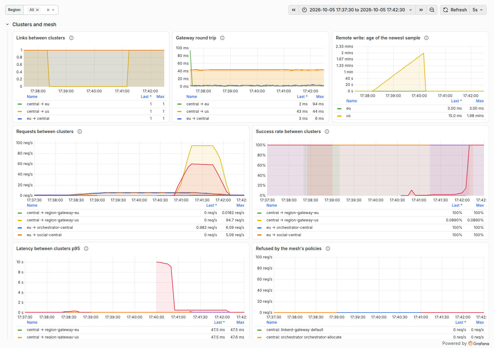
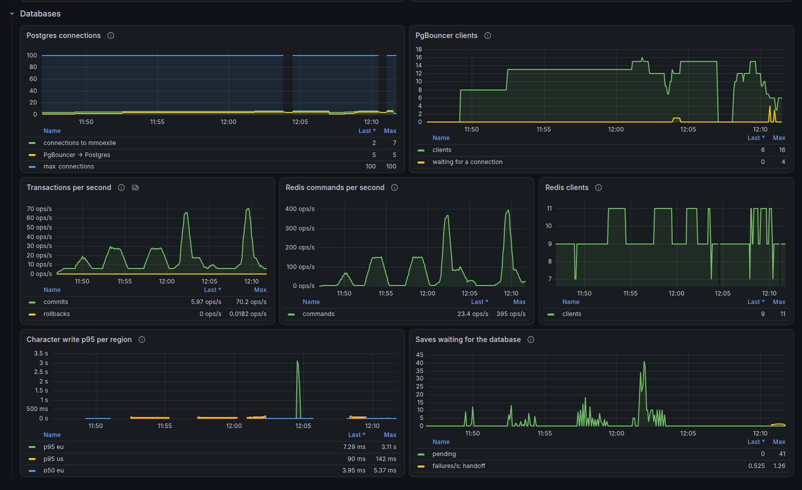
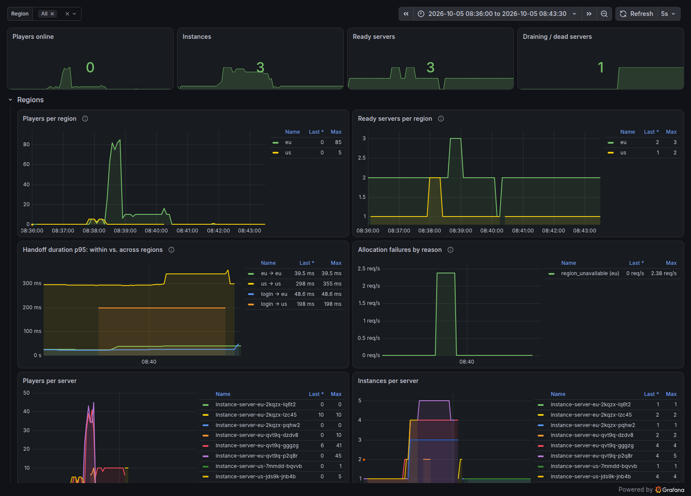

# The Realm on Kubernetes with Agones

The third way to run the realm (Stages 5–7), next to `pnpm dev` and
`pnpm realm:up`: three local [kind](https://kind.sigs.k8s.io/) clusters, one
for the central services and one per region, in which
[Agones](https://agones.dev/) runs the instance servers and
[Linkerd](https://linkerd.io/) connects and secures the services, with
Postgres and Redis next to the clusters like a cloud's managed databases.
It exists for what only clusters have: autoscaling, rolling updates,
Agones' protection of busy servers, Kubernetes operations, databases with
their own lifecycle, and a multi-region setup with a service mesh. Daily
development, the tests and the regular CI don't need it.

| Target | Command | Used for |
| :--- | :--- | :--- |
| Local processes | `pnpm db:up` + `pnpm dev` | Daily development |
| Docker Compose | `pnpm realm:up` | The whole realm on one machine: load, chaos, region tests |
| Local Kubernetes + Agones + Linkerd | `pnpm cluster:up` | Autoscaling, rolling updates, Agones, one cluster per region, the service mesh |

All three run the same code; compose and the clusters also run the same
images with the same environment variables. Compose and the clusters can
run at the same time (different ports).

**Prerequisites:** Docker, kind, kubectl, Helm, the Linkerd CLI and
openssl, and one system setting (inotify instances); see
[docs/DEVELOPMENT_SETUP.md](../../docs/DEVELOPMENT_SETUP.md). The three
clusters need about 10 GB of memory.

## Commands

```bash
pnpm cluster:up                      # create or update everything (idempotent), ~9 min the first time
pnpm cluster:status                  # clusters, links between them, pods, fleets, the orchestrator's view
pnpm cluster:reload instance-server  # rebuild one app and roll it out (any app name)
pnpm cluster:smoke                   # bots + scaling, rolling update, crash, TLS, outages, failures, mesh, ~8 min
pnpm cluster:smoke --mode failures   # only "a region's cluster lost" and "a region cut off", ~4 min
pnpm cluster:down                    # delete the clusters; the databases keep running with all data
US_LATENCY_MS=120 pnpm cluster:up    # another simulated distance to the us cluster
```

The databases have their own commands; `cluster:up` runs the first two
itself when something is missing, so one command still works from nothing:

```bash
pnpm cluster:init                    # once: CA, certificates, passwords, keys into infra/k8s/.secrets/
pnpm cluster-db:up                   # Postgres, PgBouncer, Redis (+ exporters) next to the clusters
pnpm cluster-db:psql                 # psql as the user that owns the schema (arguments go to psql)
pnpm cluster-db:down                 # stop them; data (volume) and secrets stay
pnpm cluster-db:down -- --wipe       # also delete the data and the secrets
DB_LATENCY_MS=5 pnpm cluster-db:up   # another simulated distance to the databases (default 2)
pnpm cluster:init -- --rotate        # new passwords and keys (see "Rotating secrets")
```

| What | Where |
| :--- | :--- |
| Game | http://localhost:8090 |
| Grafana (Realm Overview + Kubernetes dashboards) | http://localhost:3040 |
| Prometheus (central, with the regions' metrics) | http://localhost:9091 |
| Orchestrator's fleet view | http://localhost:3013/servers |
| Game servers eu / us (Agones host ports) | localhost:7300–7319 / 7400–7419 |
| Region pings eu / us | localhost:7350/ping / 7450/ping |
| kubectl contexts | `kind-mmoexile-central`, `kind-mmoexile-eu`, `kind-mmoexile-us` |

## What Runs Where

```
Docker network "kind"
├── cluster "mmoexile-central" (one node = one Docker container)
│     account-api ×2, social, orchestrator, directory ×2, client, the migrate Job,
│     Prometheus (receives the regions' metrics) + Grafana,
│     Linkerd + its multicluster gateway
├── cluster "mmoexile-eu"
│     Agones, Fleet instance-server-eu (2–4 GameServers),
│     region-gateway (ping + the entry point for central), Prometheus agent,
│     Linkerd + gateway
├── cluster "mmoexile-us"
│     the same for us, + tc netem: everything this node sends is 40 ms late
├── mmoexile-cloud-provider-kind   LoadBalancer addresses (the gateways)
│   └── kindccm-…                  one Envoy container per LoadBalancer Service
└── the "managed databases" (pnpm cluster-db:up, their own lifecycle)
    ├── mmoexile-db-postgres    Postgres 16, TLS only; volume mmoexile-db-postgres-data
    │   ├── mmoexile-db-pgbouncer          in Postgres' network namespace
    │   └── …-postgres-exporter, …-pgbouncer-exporter
    ├── mmoexile-db-redis       Redis 7, TLS only, no persistence
    │   └── …-redis-exporter
    └── + tc netem: what they send is DB_LATENCY_MS (2) late
```

Players reach the clusters like a cloud: the client and the APIs on
central's node (port 8090), each region's gateway and game servers on that
region's node; the `kind-*.yaml` configs publish those ports on localhost.
Services reach each other across clusters through the mesh (below). The us
node's delay applies to everything it sends: to players, to the other
clusters and to the databases.

## Files

| File | What it is |
| :--- | :--- |
| [`kind-central.yaml`](kind-central.yaml), [`kind-eu.yaml`](kind-eu.yaml), [`kind-us.yaml`](kind-us.yaml) | The clusters: one node each, port mappings, address ranges, Kubernetes version |
| [`base/central/`](base/central) | The central services' manifests, their mesh policies (`policies.yaml`) |
| [`base/region/`](base/region) | A region's manifests, region-neutral: Fleet, autoscaler, region gateway + entry point, policies |
| [`overlays/central/`](overlays/central), [`overlays/eu/`](overlays/eu), [`overlays/us/`](overlays/us) | What's specific to each local cluster: host ports, the region's name, port range and size, the secrets it gets |
| [`overlays/kind-common/`](overlays/kind-common) | Shared by all three (a kustomize Component): the databases' Services and CA |
| [`linkerd/`](linkerd) | Linkerd's Helm values: the control plane, the multicluster extension |
| [`agones/values.yaml`](agones/values.yaml) | Agones' Helm values: port ranges per region |
| [`monitoring/`](monitoring) | kube-prometheus-stack's Helm values (central; `values-region.yaml`: agents), scraping the mesh, who may write into central's Prometheus |
| [`databases/`](databases) | The databases' configuration: `pg_hba.conf`, `setup.sql` (users and privileges), `pgbouncer.ini` (pooling, the connection budget), `redis.conf` |
| [`scripts/`](scripts) | `cluster-init`, `cluster-db-up`/`-down`/`-psql`, `cluster-up`, `apply`, `reload`, `status`, `cluster-down`, shared helpers in `lib.sh` |
| `.secrets/` | Generated by `cluster:init`, git-ignored, readable only by you |

`cluster:up` generates missing secrets, starts the databases, creates the
three clusters and cloud-provider-kind, installs Linkerd in each and links
them, installs kube-prometheus-stack (everywhere) and Agones (in the
regions) with Helm, applies the delay, builds the images and loads them
into the clusters that run them (`kind load`, nothing is pushed to a
registry), then applies the manifests in order: central's configuration,
the databases' Services and their addresses, the migration Job; then the
services and Fleets of all three clusters in parallel.

## A Short Kubernetes Primer, With Our Files

- **Pod**: one or more containers that run together on one node and share
  an IP. Pods are disposable: they are replaced, not repaired.
- **Deployment** ([`base/central/account-api.yaml`](base/central/account-api.yaml)): keeps N
  identical pods running and replaces them one by one on a change (rolling
  update). Probes tell Kubernetes when a pod has started (`startupProbe`),
  is ready for traffic (`readinessProbe`, our `/ready`) and must be
  restarted (`livenessProbe`, our `/health`). The orchestrator uses
  `strategy: Recreate`, so an old and a new one never run side by side.
- **Service**: a stable name and virtual IP for a set of pods (by label),
  e.g. `http://social:3002`. `NodePort` additionally opens a port on every
  node; that's how the client, Grafana and the orchestrator reach localhost.
  `LoadBalancer` asks the cloud for an address outside the cluster; locally
  cloud-provider-kind answers with an address on kind's network (the
  mesh's gateways use it). A *headless* Service (`clusterIP: None`) has no
  virtual IP: DNS answers with the pods themselves, and with `subdomain`
  every pod gets its own name (`base/region/instance-servers.yaml`).
- **Service without a selector + EndpointSlice**
  ([`overlays/kind-common/databases.yaml`](overlays/kind-common/databases.yaml)): a
  stable in-cluster name for something outside the cluster. Kubernetes
  doesn't look for pods; the EndpointSlice says where to send the traffic
  (here the database containers' addresses, set by the scripts). `postgres`,
  `pgbouncer` and `redis` are such names.
- **StatefulSet**: like a Deployment, but each pod has a stable identity and
  its own volume, as a database in the cluster would need. Stage 5 ran
  Postgres like that; since Stage 6 it runs outside.
- **Job** ([`base/central/migrate.yaml`](base/central/migrate.yaml)): runs a pod to
  completion once, here the database migration.
- **ConfigMap / Secret**: configuration and keys for pods, here generated
  by kustomize ([`base/central/kustomization.yaml`](base/central/kustomization.yaml), the
  secrets from `.secrets/` in the overlays) with a hash in their name, so
  changing a value rolls out the pods that use it. A Secret is only base64,
  not encrypted: whoever may read Secrets in the namespace reads the
  passwords (real clusters add RBAC, encryption at rest or an external
  secret store).
- **ServiceAccount**: an identity for pods. Kubernetes uses it for API
  permissions (the instance servers' Agones sidecar may update its
  GameServer); the mesh uses it as the pod's identity. One per service.
- **Namespace**: our objects live in `mmoexile`; Agones in `agones-system`,
  monitoring in `monitoring`, Linkerd in `linkerd` and
  `linkerd-multicluster`.
- **Cluster / context**: each cluster has its own API server and its own
  objects; kubectl talks to one at a time (`--context kind-mmoexile-eu`).
  The scripts' `kc <cluster>` and `hc <cluster>` do that for kubectl and
  Helm.
- **kustomize** (`kubectl kustomize`): builds the final manifests from the
  base plus an overlay's patches; a *Component* is a piece several
  overlays include. **Helm** installs packaged third-party software
  (Agones, Linkerd, kube-prometheus-stack) with a values file.

## Agones, With Our Files

Agones adds game-server resources to Kubernetes
([`base/region/instance-servers.yaml`](base/region/instance-servers.yaml)),
installed in each region's cluster:

- **GameServer**: one instance server pod plus Agones' SDK sidecar, with a
  host port from the region's port range. Its state is what Agones
  manages: `Scheduled` → `Ready` (available) ⇄ `Allocated` (in use) →
  `Shutdown`; `Unhealthy` if health pings stop.
- **Fleet**: keeps N GameServers of one template, like a Deployment, and
  rolls out changes. One per region.
- **FleetAutoscaler**: sets N. Ours keeps a buffer of free player slots,
  read from the `players` Counter of every GameServer (eu: 60 free slots,
  2–4 servers; us: 60, 1–3).

The orchestrator still decides where every player goes (D13). Agones only
handles the lifecycle and the number of servers. The instance server
connects the two (`LIFECYCLE=agones`, `apps/instance-server/src/fleet/Agones*.ts`):

- it registers with the orchestrator as always, with the host port Agones
  assigned (`PUBLIC_URL` from the GameServer);
- it is **Allocated while it has players** (or the orchestrator just sent
  one there: the `hold` flag, and before answering a create-instance
  call), **Ready when empty**. Agones only scales down and replaces Ready
  servers, so a server with players is never removed;
- it keeps the `players` Counter current and pings Health;
- on SIGTERM it drains as everywhere else, then calls Shutdown.

**Rolling update** (`pnpm cluster:reload instance-server`): Agones
replaces old Ready servers itself, but never Allocated ones, and it counts
those toward the Fleet's size: while every old server has players, it
starts no new one. So the script first gives the FleetAutoscaler room for
one more server (its minimum + one server), which Agones starts in the new
version. Then it drains the old servers through the orchestrator one at a
time (from inside the orchestrator's pod: no service may call the drain
through the mesh; hub players move at once, dungeons get `DRAIN_TIMEOUT_SEC`, 60 s);
each one is replaced by a new-version server before the next is drained.
Finally the autoscaler's bounds are put back. Nobody is kicked; with 40
bots playing it takes about a minute.

A draining server keeps pinging Health: without it, Agones would declare it
Unhealthy after 15 s and kill it mid-drain.

**Autoscaling** reacts within ~10–15 s (the autoscaler checks every 10 s,
a new server needs a few seconds to start). A burst of players larger than
the buffer fills the region in the meantime: those logins and portal hops
fail with "region unavailable" until the new server is up. A bigger buffer
avoids that at the cost of idle servers. An empty dungeon that was still
asleep on a server removed by scale-down is lost, like one that timed out.

## Three Clusters

Since Stage 7 the realm runs like a multi-region deployment: the central
services in one cluster, each region in its own. A region is then really
separate: its own Kubernetes, its own Agones, its own failures. The cost:
the services no longer share one network. In a cloud the clusters would be
in different VPCs (or providers); locally they are three kind clusters on
one Docker network, with separate address ranges (central 10.10.x, eu
10.20.x, us 10.30.x) whose pods can't reach each other's pods.

What crosses clusters:

| From | To | What |
| :--- | :--- | :--- |
| instance servers (eu, us) | `orchestrator-central` | register, heartbeat, allocate (zone changes) |
| instance servers (eu, us) | `social-central` | parties |
| orchestrator (central) | `region-gateway-eu` / `-us` | create an instance on a server (the regional entry point) |
| Prometheus agents (eu, us) | `monitoring-kube-prometheus-prometheus-central` | their metrics (remote write) |

Each region gets only what it needs: the ticket *public* key and the
services' database user. The keys that sign sessions and tickets and the
migration user stay in central.

## The Service Mesh (Linkerd)

Until Stage 6, "the internal network is trusted": any pod could call any
service, in plain HTTP. With services spread over three clusters (in a
cloud: over networks you don't control), that no longer holds. A
**service mesh** fixes it without touching the services' code: every pod
gets a small proxy next to it (Linkerd's, a *sidecar*), and all its
traffic to and from other services passes through those proxies.

- **mTLS (mutual TLS):** proxy-to-proxy connections are encrypted, and both
  sides prove who they are with a certificate. Nobody on the network can
  read or fake a call.
- **Identities:** a pod's certificate names its ServiceAccount, e.g.
  `orchestrator.mmoexile.serviceaccount.identity.linkerd.cluster.local`.
  Linkerd's identity service issues them (valid 24 h, renewed
  automatically), signed by the cluster's **issuer**, which is signed by
  the **trust anchor**. Our trust anchor is the CA from `cluster:init`;
  each cluster has its own issuer (`linkerd-issuer-<cluster>`), so proxies
  in different clusters trust each other.
- **Injection:** the namespace `mmoexile` is annotated
  `linkerd.io/inject: enabled`; Linkerd's admission webhook adds the proxy
  (an init container that redirects the pod's traffic with iptables, and
  the proxy as a native sidecar, so it starts first and stops last). If
  the webhook isn't running, pods are refused rather than started without
  a proxy (`webhookFailurePolicy: Fail`): after a node restart, Agones
  briefly retries.
- **What stays outside:** players aren't in the mesh: the game port (7777),
  the pings (80) and the client (80) skip the proxy inbound. The
  databases already use TLS with their own certificates, so their ports
  skip it outbound. The migrate Job isn't meshed (it would never end with
  a proxy next to it). The Agones SDK sidecar talks to the game server on
  localhost, which the proxy never sees.

### Across clusters: gateways and mirrored services

Linkerd's multicluster extension ([`linkerd/multicluster.yaml`](linkerd/multicluster.yaml)):

- every cluster runs a **gateway**: a proxy behind a `LoadBalancer` Service
  (an address from cloud-provider-kind) through which other clusters reach
  its exported Services;
- a **link** lets one cluster mirror another's Services: the target
  generates a `Link` (its gateway's address, its API server, credentials
  that may only read Services; `linkerd multicluster link-gen`), the
  source applies it, and its **service mirror** watches the target's
  Services labelled `mirror.linkerd.io/exported: "true"` and creates local
  copies named `<service>-<cluster>`, whose endpoint is the target's
  gateway. Links: eu → central, us → central, central → eu, central → us;
- a call to `orchestrator-central:3003` from eu then goes: the caller's
  proxy → (mTLS) → central's gateway → (mTLS) → the orchestrator's proxy →
  the orchestrator. The service mirrors probe each linked gateway every
  few seconds (`linkerd multicluster gateways`, Grafana's "Links between
  clusters").

### The regional entry point

The orchestrator calls an instance server to create an instance. Within one
cluster it used the pod's IP; across clusters pods aren't reachable. So
each region's gateway (nginx, [`base/region/entry-point.nginx.conf`](base/region/entry-point.nginx.conf))
has a second port, 9000, reachable only through the mesh and exported as
`region-gateway-<region>`: `/servers/<id>/…` goes to
`<id>.instance-servers.mmoexile.svc.cluster.local:9001/…` (a headless
Service gives every GameServer pod that name). Instance servers register
`http://region-gateway-<region>:9000/servers/<id>` as their internal URL:
the orchestrator needs no knowledge of clusters, and the services' code
didn't change.

### Authorization: only the intended calls

The namespace denies by default (`config.linkerd.io/default-inbound-policy:
deny`); [`base/central/policies.yaml`](base/central/policies.yaml) and
[`base/region/policies.yaml`](base/region/policies.yaml) allow what is
meant to happen, with Linkerd's policy resources:

| Resource | Says |
| :--- | :--- |
| `Server` | a port of some pods, e.g. the orchestrator's HTTP port |
| `HTTPRoute` | requests on it by path and method, e.g. `POST /allocate` |
| `MeshTLSAuthentication` | callers by identity, e.g. ServiceAccount `account-api` |
| `NetworkAuthentication` | callers by address, without identity (outside the mesh) |
| `AuthorizationPolicy` | route (or Server) + authentication = allowed |

| Caller | May call |
| :--- | :--- |
| client (browsers through its nginx) | account-api, directory |
| account-api | orchestrator `POST /allocate` (logins) |
| instance servers (from a region) | orchestrator register, heartbeat, `POST /allocate` (zone changes); social `/parties/*` |
| orchestrator (from central) | a region's entry point, which may call its servers' `POST /internal/instances` |
| regions' Prometheus agents | central Prometheus' `POST /api/v1/write` |
| anyone | health, readiness, metrics; the orchestrator's read-only fleet view (`GET /servers`) |
| nobody | the orchestrator's drain (`pnpm cluster:reload` calls it inside the pod) |

A refused call gets 403 (404 if no route matches); Grafana shows refusals
in "Refused by the mesh's policies". One limit of gateway-based
multicluster: a call from another cluster arrives with the local
*gateway's* identity, not the caller's. So each gateway decides who may
enter at all (central's: the instance servers and the agents; the
regions': the orchestrator; `cluster-up.sh` narrows the chart's "any meshed
identity"), and the services authorize "from the gateway" for the routes
that other clusters use. Linkerd's identities also don't name the cluster:
an instance server in eu and one in us look alike.

## Monitoring Across Clusters

Central runs kube-prometheus-stack as before, with the remote-write
receiver on; the regions run Prometheus in **agent mode**
([`monitoring/values-region.yaml`](monitoring/values-region.yaml)): it
scrapes the region (instance servers, Agones, the proxies), stores nothing
to query, and sends the samples through the mesh to central, with a label
`cluster="eu"`/`"us"`. One Prometheus to ask, the dashboards unchanged
(they already filter by region). Only the metric families the dashboards
use are sent. The Realm Overview's "Clusters and mesh" row shows the links,
the gateways' round trip, how far behind the regions' metrics are, and
requests, success rate, latency and refusals between clusters.



*The "Clusters and mesh" row during `pnpm cluster:smoke --mode failures`:
the us node killed at 17:38:15 and started again at 17:38:37 (central's
link to us down, us metrics up to 2 min behind until us worked again at
17:40:11), then us cut off from central from 17:40:12 for 30 s. Right after the cut, bots in us retried zone changes into new
instances: central's calls to `region-gateway-us` failed (up to 95/s, with
10 s timeouts) until the mesh routed to us again ~25 s later.*

## When a Region Fails

`pnpm cluster:smoke` tests the two cases that matter most
(D34; [docs/ARCHITECTURE.md](../../docs/ARCHITECTURE.md#when-a-region-fails)):

- **A region's cluster is lost** (the us node killed): the orchestrator
  misses the us servers' heartbeats and marks them dead within ~6 s;
  logins choosing us get `503 region_unavailable` ("North America is
  unavailable right now"); eu plays on undisturbed. Players who were in us
  lost their connection with the cluster. When the node comes back,
  Kubernetes, Linkerd and Agones start again, new servers register, and
  logins into us work again after ~1–1.5 min, without anyone doing
  anything.
- **A region is cut off from central** (iptables on both nodes: the
  clusters can't reach each other, players and databases still can):
  players in us keep playing, saves continue; zone changes there are
  refused at once with "The realm's central services can't be reached
  right now, so zone changes are paused" (D35: no second placement path);
  logins into us get `503 region_unavailable`, because the orchestrator
  sees the us servers as dead. When the link is back, the servers'
  heartbeats revive them in the orchestrator (with their instances),
  nobody was kicked, and zone changes work again: into existing instances
  at once, into new ones after ~25–30 s (until the mesh routes central →
  us again).
- **Central lost** is every region cut off at once, plus no logins at
  all (account-api is in central): players already in a region keep
  playing and saving, nobody can join or change zones until central is
  back. Not tested separately.

Try them with bots online and Grafana open:

```bash
docker kill mmoexile-us-control-plane; sleep 30; docker start mmoexile-us-control-plane
docker exec mmoexile-us-control-plane tc qdisc replace dev eth0 root netem delay 40ms  # a restarted node loses its delay
```

## The Databases Next to the Clusters

In production, databases usually aren't pods: they are managed services
(RDS, Cloud SQL, ElastiCache) with their own lifecycle, reached over the
network with TLS and credentials. `pnpm cluster-db:up` imitates that with
Docker containers on kind's network: deleting the clusters keeps every
account and character, and the services of all three clusters talk to the
same databases the way they would in a cloud.

**How a pod reaches them:** the services connect to `pgbouncer:6432`,
`redis:6380` (and the migrate Job to `postgres:5432`): in-cluster names
(Services without a selector) whose EndpointSlices point at the
containers, in every cluster that uses them (central also has `postgres`
and the exporters). `cluster-db:up` and `apply.sh` keep the addresses
current. These connections bypass the mesh: they have their own TLS.

**TLS with a local CA:** `cluster:init` creates a certificate authority (a
key that signs certificates) and a certificate per server, valid for the
names clients use (the Service names, the container names, localhost). The
CA's certificate is mounted into every pod (ConfigMap `database-ca`); a
client that trusts it can check that it really talks to our Postgres, not
to anything that answers on that address. Postgres, PgBouncer and Redis
accept only TLS. Watch out with Prisma: it checks the certificate only with
`sslaccept=strict` (in `DATABASE_URL`, with `sslcert=<CA file>`); without
it, Prisma accepts any certificate. ioredis checks against `REDIS_CA_FILE`.

**Least privilege:** each user may do only what it needs.

| User | Used by | May |
| :--- | :--- | :--- |
| `mmoexile_migrate` | the migrate Job, `cluster-db:psql` | own the schema: create and change tables |
| `mmoexile_app` | the services, through PgBouncer | read and write rows; no `CREATE`, `ALTER`, `DROP`, `TRUNCATE` |
| `mmoexile_monitor` | the exporters | read Postgres' statistics (`pg_monitor`), at most 3 connections |
| `postgres` (superuser) | only from inside the container | everything; refused over the network (`pg_hba.conf`) |
| Redis `mmoexile` | the services | all commands except `@admin` and `@dangerous` (no `FLUSHALL`, `CONFIG`, `KEYS`, …) |
| Redis `monitor` | the exporter | `INFO` and a few read-only commands |
| Redis `default` | nobody | disabled |

A service that gets compromised can then damage rows, but not the schema,
other databases or the server.

### Connection budget

Every Prisma client keeps a pool of connections; by default up to
2 × CPU cores + 1 per process (129 on a 64-core machine, more than
Postgres' default of 100 in total). So each service sets its pool
(`DATABASE_POOL_SIZE`): account-api 5 per pod, instance servers 3 per
server. Those are *client* connections to **PgBouncer**, which runs in
**transaction pooling** mode: a connection to Postgres belongs to a client
only for the duration of one transaction. Many clients share few server
connections:

| | Connections |
| :--- | :--- |
| Clients at the fleets' maximum (kind) | account-api 2 × 5 + instance servers (eu 4 + 1 during a rolling update, us 3 + 1) × 3 = 37 |
| PgBouncer → Postgres | at most `default_pool_size` 20 + `reserve_pool_size` 5, capped by `max_db_connections` 30 |
| Postgres `max_connections` 100 | ≥ 30 (PgBouncer) + 1 (migrations) + 3 (monitoring) + 3 reserved for the superuser |

`max_client_conn` (1000) leaves room for ~300 servers without touching
Postgres. Transaction pooling has one rule: no session state across
transactions (`SET`, advisory locks, `LISTEN`); our services use single
statements, and Prisma's prepared statements work through PgBouncer
(`max_prepared_statements`). Measured with the eu fleet at its maximum
(180 bots): 19 client connections, 6 to Postgres. Grafana's "Databases"
row shows both.

### Outages

There is one Postgres and one Redis, without failover (that would be the
next step in a real setup). Instead, a short outage must not kick anyone
([docs/ARCHITECTURE.md](../../docs/ARCHITECTURE.md#database-outages)):

- **Postgres away (30 s):** players keep playing; saves are kept and
  retried, and written once it is back; zone changes are refused with a
  chat message (a zone change that runs into the outage waits for its
  save); logins get a 503 "try again in a moment" after at most 5 s.
- **Redis away (10 s, shorter than the 30 s lease):** commands wait, then
  continue. If Redis restarts empty, servers take their characters'
  leases back; parties and presence are rebuilt, messages in flight are
  lost.

Try it with bots online and Grafana open:

```bash
docker pause mmoexile-db-postgres; sleep 30; docker unpause mmoexile-db-postgres
docker pause mmoexile-db-redis; sleep 10; docker unpause mmoexile-db-redis
```

### Rotating secrets

`pnpm cluster:init -- --rotate` creates new passwords and keys (the CA and
certificates stay; `--rotate-ca` replaces those too). Then
`pnpm cluster-db:up` gives the databases the new passwords, and
`pnpm cluster:up` (or `scripts/apply.sh` plus
`pnpm cluster:reload instance-server`) rolls them out to the pods. In
between, pods with the old passwords can't open new connections, and
servers with the old ticket key reject tickets signed with the new one: a
short outage. Real systems rotate without one by allowing two valid
credentials at a time (create the new one, roll out, then delete the old
one).

### Distance

The database containers delay what they send by `DB_LATENCY_MS` (2 ms, as
if in another availability zone); PgBouncer reaches Postgres on localhost,
undelayed. Measured with 10 bots per region between nexus and overworld
(zone change: ticket issued → admitted on the target, incl. reconnect):

| | Character write p50 | Zone change eu p50 / p95 | Zone change us p50 / p95 |
| :--- | :--- | :--- | :--- |
| Compose (Stage 4) | | 7 / 22 ms | 232 / 292 ms |
| Cluster, databases 0 ms away (TLS, PgBouncer) | 2.2 ms | 14 / 24 ms | 261 / 296 ms |
| Cluster, databases 2 ms away | 4.0 ms | 18 / 25 ms | 276 / 299 ms |
| Three clusters with the mesh (Stage 7) | 4.0 ms | 18 / 25 ms | 276 / 299 ms |



*The "Databases" row during `pnpm cluster:smoke`: Postgres sees a handful
of connections (of 100) while PgBouncer serves up to 16 clients; at the
end, the 30 s Postgres outage (failed zone-change saves, retried) and the
10 s Redis outage.*

A zone change makes three sequential database round trips (save, claim +
lease, take over), so 2 ms more per round trip shows up as a few ms. In us
the 40 ms per round trip dominate. The cluster's own network (kube-proxy,
another node) costs a few ms more than compose.

**The mesh's cost** (Stage 7): the zone-change timings didn't move (the
histograms' buckets are a few ms wide). Measured directly, 200 sequential
requests from an instance server's pod to the orchestrator:

| Request | Without the mesh (NodePort) p50 / p95 | Through the mesh (mTLS, both gateways) p50 / p95 |
| :--- | :--- | :--- |
| eu → central | 0.8 / 1.1 ms | 1.1 / 2.1 ms |
| us → central | 42.2 / 43.5 ms | 43.0 / 44.0 ms |
| central → a server in eu, through the entry point | | 2.6 / 3.8 ms |
| central → a server in us, through the entry point | | 44.9 / 47.0 ms |

Three proxies and two TLS handshakes' worth of encryption (the connections
are reused) add about 0.3–1 ms per call; the regional entry point adds an
nginx and two more proxies. Against 40 ms of distance that is noise.

## Looking Around

```bash
kubectl config use-context kind-mmoexile-eu     # one cluster at a time (or --context on every call)
kubectl -n mmoexile get pods -o wide            # what runs there
kubectl -n mmoexile get gameservers             # GameServers, their state, port and node
kubectl -n mmoexile get fleets,fleetautoscalers
kubectl -n mmoexile logs <gameserver-name> -c instance-server -f
kubectl -n mmoexile logs <gameserver-name> -c linkerd-proxy  # its proxy
kubectl -n mmoexile describe gameserver <name>  # events: Ready, Allocated, Unhealthy, ...
kubectl -n mmoexile delete pod <gameserver-name>  # the pod drains, Agones replaces it
kubectl -n mmoexile get events --sort-by=.lastTimestamp
kubectl -n mmoexile get svc -l mirror.linkerd.io/mirrored-service=true  # the other clusters' services here
kubectl -n mmoexile get server,httproute,authorizationpolicy  # the mesh's policies
kubectl --context kind-mmoexile-central -n mmoexile logs deploy/orchestrator -c orchestrator -f
linkerd --context kind-mmoexile-central check  # (its multicluster checks need the nodes' names; see lib.sh)
linkerd --context kind-mmoexile-central multicluster gateways  # the links: alive, latency
linkerd --context kind-mmoexile-eu diagnostics proxy-metrics -n mmoexile po/<pod> | grep tls=  # identities of calls
docker ps --filter label=mmoexile.dev/database  # the databases and exporters
pnpm cluster-db:psql -- -c 'select count(*) from "Character"'
```



*The Realm Overview in the cluster's Grafana during `pnpm cluster:smoke`
(Stage 5): bots in both regions, 70 more in eu (the eu fleet goes from 2 to
3 servers and back), the rolling update (new servers in "Players per
server") and a crashed server (the dead one on the right of "Draining /
dead servers").*
